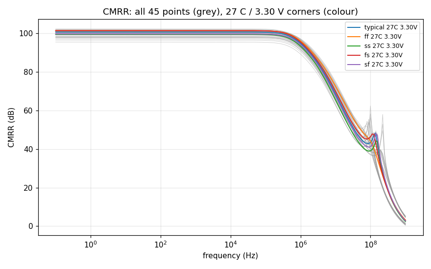
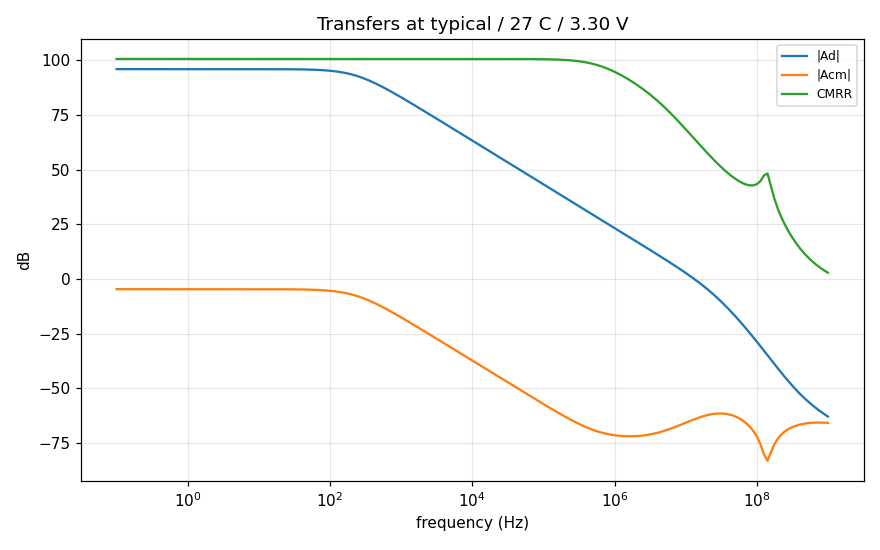

# CMRR record `20261009-105631-30ec86d`

- **Date**: 2026-10-09 10:56 UTC; commit `30ec86d`; issue #39
- **DUT**: `design/netlist/opamp_two_stage.spice` (sha256 of the wrapper-normalised include `81fbd914f8254a49`), unchanged; snapshot `netlist-snapshots/20261009-105631-30ec86d.spice`
- **PDK revision**: gf180mcuD, open_pdks `c6d73a35f524070e85faff4a6a9eef49553ebc2b` (harness `find_pdk`, via volare-default); the local single units are pinned to it (`models.pdk_root`).
  - klt's `provenance.pdk` and `environment.models_lib_sha256` in the grid reports are resolved on the SUBMITTING CLIENT (open_pdks f6eeac7dad085ffcc829ccfd721f7b4ce39edcf7 (search root: ~/.ciel)), not on the fleet runner, which uses its own install and (klt 0.5.0) does not report its revision. The fleet library is tied to the pinned revision indirectly: the local pinned units reproduce the grid's nominal point, and the grid's open-loop response reproduces the committed gain-bench record (see Cross-checks).
- **Tools**: ngspice local `ngspice-46 : Circuit level simulation program`, klt `klt 0.7.0+g5c94de0ebbfe`, numpy `1.26.4`
- **Execution**: two `klt sim` corner requests (one per excitation), 45 points each:
  - `dm`: backend `aws-batch-fleet`, job `klt-sim-44ea0fd17cee`, Spot m7i.4xlarge, state `done`, runner klt `0.5.0` vs client `0.7.0+g5c94de0ebbfe` (compatibility `mismatch`); engine `ngspice 46`; wall 87 s
  - `cm`: backend `aws-batch-fleet`, job `klt-sim-82d779ebef4e`, Spot m7i.4xlarge, state `done`, runner klt `0.5.0` vs client `0.7.0+g5c94de0ebbfe` (compatibility `mismatch`); engine `ngspice 46`; wall 83 s
  - Local single units (studies/controls below) run with an empty `HOME` so no user `~/.spiceinit` applies (the fleet grid runs without one; DR-0004).
- **Corner matrix**: process typical, ff, ss, fs, sf; T -40 C, 27 C, 125 C; VDD 2.97 V, 3.30 V, 3.63 V (DC input common mode = VDD/2); ibias = 10 uA (ideal); CL = 2 pF. Every MOS corner uses `res_typical` + `mimcap_typical` (RZ/CC passive spread is NOT swept).

## Claim

**Measured, no pass or fail verdict: the row's bound is not ratified** (DR-3 residual (e3)). `spec/target-spec.md` and the decision records are untouched; a proposed bound citing this record is a separate decision-record issue for a human to ratify.

**Systematic only.** Every device in the simulated schematic is perfectly matched, so this CMRR is the systematic (topology- and bias-limited) figure. Real CMRR is usually limited by random mismatch (input pair, load mirror); a mismatch-limited CMRR needs Monte Carlo, which is DR-3 residual (e2)'s subject and out of scope here. The mirror-imbalance control below shows how strongly a 10 % load-mirror imbalance moves it.

## Worst case over the 45 points

| CMRR figure | worst (lowest) value (dB) | worst-case corner (process / T / VDD) | best (dB) | points without the figure |
|---|---|---|---|---|
| DC plateau (0.1-1 Hz) | **95.42** | ss / 125 C / 2.97 V | 102.27 | 0 |
| 1 kHz | **95.42** | ss / 125 C / 2.97 V | 102.27 | 0 |
| 10 kHz | **95.42** | ss / 125 C / 2.97 V | 102.27 | 0 |
| 100 kHz | **95.29** | ss / 125 C / 2.97 V | 102.12 | 0 |
| 1 MHz | **89.19** | ss / 125 C / 2.97 V | 97.15 | 0 |
| at f_u (differential unity gain) | **60.99** | ss / -40 C / 2.97 V | 71.01 | 0 |

- Low-frequency plateau verified at 45/45 points; lower bounds (numerical floor): 0/45.
- Acm keeps one sign (plateau phase ~0 deg) at all 45 points; no CMRR value exceeds the grid median (100.4 dB) by more than 20 dB.
- f_u (differential unity-gain frequency) over the grid: 10.418 .. 16.528 MHz; Ad plateau 93.79 .. 97.41 dB.

## Method

- `.ac dec 20 0.1 1e+09` (201 points) per point and excitation: `dm` (vinp +0.5 V, vinn -0.5 V AC) and `cm` (vinp = vinn = 1 V AC), same DC common mode.
- DC loop closed by an ideal servo (`Esb` buffer of vout -> `Rsv`/`Csv` low-pass, tau = 1e18 s -> `Esv` in series with the vinn AC source): the unity-buffer operating point at DC, an open loop at every swept frequency, no load on vout, and equal AC drive possible on both input pins. The gain bench's `Cfb vinn 0` AC-grounds vinn and cannot carry a CM signal.
- From the ACTUAL phasors, vd = v(vinp) - v(vinn), vc = (v(vinp) + v(vinn))/2; the two runs are solved exactly for Ad and Acm per frequency (vout = Ad vd + Acm vc). CMRR = 20 log10 |Ad/Acm|.
- **DC** = mean CMRR over 0.1-1 Hz, valid only if CMRR and |Acm| are flat there to 0.1 dB (else reported unavailable with the 0.1 Hz value). AC has no literal 0 Hz sample.
- **Spot values and the value at f_u**: linear interpolation in (log10 f, dB) between sweep points; f_u is the first descending 0 dB crossing of |Ad| (the gain driver's extraction, reused unchanged; a second crossing or a non-flat / wrong-polarity Ad plateau invalidates the point).
- **Numerical floor**: |Acm| below 10 x the demonstrated superposition residual (= 2.62e-10 V/V, see Studies) is clamped to it and the figure reported as a lower bound (`>=`); there is no division by zero and no infinite CMRR.
- **Blocking validation**: 45/45 points per excitation, identical frequency axes, finite data, differential excitation within 1e-06 V of (vd = 1, vc = 0), CM excitation within 1e-06 V of vc = 1 with |vd/vc| <= 1e-06, operating point (below), Ad vs the gain bench, local vs grid, and the studies/controls.

## Excitation and cross-checks

- Differential excitation error max 1.18e-13 V; CM excitation error max 6.6e-19 V; CM residual differential |vd/vc| max 1.32e-18.
- Joint solve vs the naive CM ratio vout_cm/vc_cm: max difference 4.44e-15 dB over all sweeps (the solve guards against unequal drive; here the drive is equal).
- **Decomposition vs the gain bench** (`sim/gain-gbw-pm/corners/20261009-055759-2524b3e`, committed |vout/vdiff|, same 201 frequencies): the gain bench drives vinp alone (vd = 1 V, vc = 0.5 V), so its response must equal Ad + Acm/2 from this record's solve. All 45 points, whole sweep: max deviation 4.58e-06 dB (tolerance 0.05 dB). This independently validates the servo bench and the joint Ad/Acm solve (comparing Ad alone would differ above f_u, where Acm is no longer negligible).
- **Local nominal unit vs the grid's nominal point**: CMRR differs by at most 0.0000 dB (tolerance 0.05 dB) at the plateau, the spots and f_u.

## Operating point (every point, every excitation)

The analysis line prints the DC operating point of the same deck after the `.ac` sweep (`op` + `print`, retained in each point's log). Blocking: the operating point is returned, |vout - VCM| <= 100 mV (no saturated or differently biased DUT), and every excitation of a point sits at the same DC vout to 1 uV. Recorded: each DUT MOSFET's saturation margin |Vds| - |Vdsat|.

- max |vout - VCM| over the grid: 0.035 mV; max DC vout disagreement between excitations: 0.0000 uV.
- smallest device saturation margin: 220 mV at ss / -40 C / 2.97 V.
- points with a device below saturation: 0/45

## CMRR at all 45 points (dB)

| point | CMRR DC | 1 kHz | 10 kHz | 100 kHz | 1 MHz | at f_u | f_u (MHz) | note |
|---|---|---|---|---|---|---|---|---|
| typical / -40 C / 2.97 V | 99.57 | 99.57 | 99.57 | 99.49 | 94.86 | 63.41 | 15.679 |  |
| typical / 27 C / 2.97 V | 99.26 | 99.26 | 99.26 | 99.15 | 93.58 | 64.01 | 13.164 |  |
| typical / 125 C / 2.97 V | 97.80 | 97.80 | 97.80 | 97.67 | 91.66 | 64.60 | 10.877 |  |
| typical / -40 C / 3.30 V | 100.48 | 100.48 | 100.48 | 100.40 | 95.83 | 63.48 | 15.768 |  |
| typical / 27 C / 3.30 V | 100.64 | 100.64 | 100.64 | 100.52 | 94.78 | 64.16 | 13.220 |  |
| typical / 125 C / 3.30 V | 99.78 | 99.78 | 99.78 | 99.63 | 93.08 | 64.90 | 10.911 |  |
| typical / -40 C / 3.63 V | 100.60 | 100.60 | 100.59 | 100.52 | 96.23 | 63.49 | 15.849 |  |
| typical / 27 C / 3.63 V | 101.36 | 101.36 | 101.36 | 101.24 | 95.50 | 64.30 | 13.271 |  |
| typical / 125 C / 3.63 V | 101.47 | 101.47 | 101.47 | 101.29 | 94.19 | 65.38 | 10.942 |  |
| ff / -40 C / 2.97 V | 100.56 | 100.56 | 100.56 | 100.48 | 96.25 | 66.62 | 16.360 |  |
| ff / 27 C / 2.97 V | 100.42 | 100.42 | 100.42 | 100.32 | 95.15 | 67.49 | 13.735 |  |
| ff / 125 C / 2.97 V | 99.05 | 99.05 | 99.05 | 98.94 | 93.39 | 68.64 | 11.350 |  |
| ff / -40 C / 3.30 V | 100.99 | 100.99 | 100.98 | 100.92 | 96.86 | 66.85 | 16.447 |  |
| ff / 27 C / 3.30 V | 101.32 | 101.32 | 101.32 | 101.22 | 96.02 | 68.03 | 13.791 |  |
| ff / 125 C / 3.30 V | 100.64 | 100.64 | 100.63 | 100.51 | 94.56 | 69.74 | 11.383 |  |
| ff / -40 C / 3.63 V | 100.87 | 100.87 | 100.87 | 100.81 | 97.15 | 67.45 | 16.528 |  |
| ff / 27 C / 3.63 V | 101.84 | 101.84 | 101.84 | 101.74 | 96.68 | 69.01 | 13.842 |  |
| ff / 125 C / 3.63 V | 102.27 | 102.27 | 102.27 | 102.12 | 95.62 | 71.01 | 11.413 |  |
| ss / -40 C / 2.97 V | 97.62 | 97.62 | 97.62 | 97.53 | 92.72 | 60.99 | 15.004 |  |
| ss / 27 C / 2.97 V | 97.04 | 97.04 | 97.04 | 96.92 | 91.25 | 61.49 | 12.615 |  |
| ss / 125 C / 2.97 V | 95.42 | 95.42 | 95.42 | 95.29 | 89.19 | 61.96 | 10.418 |  |
| ss / -40 C / 3.30 V | 99.57 | 99.57 | 99.57 | 99.48 | 94.53 | 61.28 | 15.097 |  |
| ss / 27 C / 3.30 V | 99.46 | 99.46 | 99.46 | 99.34 | 93.26 | 61.82 | 12.673 |  |
| ss / 125 C / 3.30 V | 98.33 | 98.33 | 98.32 | 98.17 | 91.35 | 62.32 | 10.455 |  |
| ss / -40 C / 3.63 V | 100.11 | 100.11 | 100.11 | 100.03 | 95.23 | 61.25 | 15.178 |  |
| ss / 27 C / 3.63 V | 100.59 | 100.59 | 100.59 | 100.46 | 94.24 | 61.83 | 12.724 |  |
| ss / 125 C / 3.63 V | 100.29 | 100.29 | 100.29 | 100.10 | 92.62 | 62.41 | 10.486 |  |
| fs / -40 C / 2.97 V | 100.85 | 100.85 | 100.85 | 100.76 | 95.86 | 64.39 | 15.908 |  |
| fs / 27 C / 2.97 V | 100.44 | 100.44 | 100.44 | 100.32 | 94.54 | 65.11 | 13.355 |  |
| fs / 125 C / 2.97 V | 98.52 | 98.52 | 98.52 | 98.40 | 92.52 | 65.95 | 11.038 |  |
| fs / -40 C / 3.30 V | 101.28 | 101.28 | 101.28 | 101.20 | 96.50 | 64.51 | 15.998 |  |
| fs / 27 C / 3.30 V | 101.36 | 101.36 | 101.36 | 101.24 | 95.44 | 65.41 | 13.413 |  |
| fs / 125 C / 3.30 V | 100.15 | 100.15 | 100.15 | 100.01 | 93.73 | 66.66 | 11.075 |  |
| fs / -40 C / 3.63 V | 101.36 | 101.36 | 101.36 | 101.28 | 96.85 | 64.83 | 16.078 |  |
| fs / 27 C / 3.63 V | 101.92 | 101.92 | 101.92 | 101.81 | 96.08 | 66.03 | 13.465 |  |
| fs / 125 C / 3.63 V | 101.50 | 101.50 | 101.50 | 101.35 | 94.70 | 67.64 | 11.107 |  |
| sf / -40 C / 2.97 V | 98.07 | 98.07 | 98.07 | 97.99 | 93.60 | 62.54 | 15.433 |  |
| sf / 27 C / 2.97 V | 97.71 | 97.71 | 97.71 | 97.61 | 92.30 | 63.08 | 12.964 |  |
| sf / 125 C / 2.97 V | 96.43 | 96.43 | 96.43 | 96.31 | 90.40 | 63.57 | 10.708 |  |
| sf / -40 C / 3.30 V | 99.47 | 99.47 | 99.47 | 99.40 | 95.04 | 62.73 | 15.523 |  |
| sf / 27 C / 3.30 V | 99.69 | 99.69 | 99.69 | 99.58 | 94.00 | 63.32 | 13.019 |  |
| sf / 125 C / 3.30 V | 99.10 | 99.10 | 99.09 | 98.95 | 92.33 | 63.87 | 10.742 |  |
| sf / -40 C / 3.63 V | 99.60 | 99.60 | 99.60 | 99.54 | 95.53 | 62.68 | 15.602 |  |
| sf / 27 C / 3.63 V | 100.62 | 100.62 | 100.62 | 100.51 | 94.92 | 63.32 | 13.069 |  |
| sf / 125 C / 3.63 V | 101.44 | 101.44 | 101.43 | 101.24 | 93.73 | 64.00 | 10.771 |  |

## Ad and Acm at the plateau (dB)

| point | Ad | Acm | CMRR DC |
|---|---|---|---|
| typical / -40 C / 2.97 V | 96.12 | -3.45 | 99.57 |
| typical / 27 C / 2.97 V | 95.28 | -3.98 | 99.26 |
| typical / 125 C / 2.97 V | 94.14 | -3.66 | 97.80 |
| typical / -40 C / 3.30 V | 96.79 | -3.69 | 100.48 |
| typical / 27 C / 3.30 V | 95.99 | -4.65 | 100.64 |
| typical / 125 C / 3.30 V | 94.89 | -4.89 | 99.78 |
| typical / -40 C / 3.63 V | 97.29 | -3.30 | 100.60 |
| typical / 27 C / 3.63 V | 96.52 | -4.83 | 101.36 |
| typical / 125 C / 3.63 V | 95.47 | -6.00 | 101.47 |
| ff / -40 C / 2.97 V | 96.29 | -4.26 | 100.56 |
| ff / 27 C / 2.97 V | 95.42 | -5.00 | 100.42 |
| ff / 125 C / 2.97 V | 94.19 | -4.87 | 99.05 |
| ff / -40 C / 3.30 V | 96.94 | -4.05 | 100.99 |
| ff / 27 C / 3.30 V | 96.10 | -5.22 | 101.32 |
| ff / 125 C / 3.30 V | 94.90 | -5.74 | 100.64 |
| ff / -40 C / 3.63 V | 97.41 | -3.46 | 100.87 |
| ff / 27 C / 3.63 V | 96.60 | -5.24 | 101.84 |
| ff / 125 C / 3.63 V | 95.44 | -6.83 | 102.27 |
| ss / -40 C / 2.97 V | 95.81 | -1.81 | 97.62 |
| ss / 27 C / 2.97 V | 94.95 | -2.09 | 97.04 |
| ss / 125 C / 2.97 V | 93.79 | -1.62 | 95.42 |
| ss / -40 C / 3.30 V | 96.52 | -3.05 | 99.57 |
| ss / 27 C / 3.30 V | 95.70 | -3.77 | 99.46 |
| ss / 125 C / 3.30 V | 94.59 | -3.74 | 98.33 |
| ss / -40 C / 3.63 V | 97.05 | -3.06 | 100.11 |
| ss / 27 C / 3.63 V | 96.27 | -4.32 | 100.59 |
| ss / 125 C / 3.63 V | 95.21 | -5.08 | 100.29 |
| fs / -40 C / 2.97 V | 96.00 | -4.84 | 100.85 |
| fs / 27 C / 2.97 V | 95.20 | -5.24 | 100.44 |
| fs / 125 C / 2.97 V | 94.10 | -4.42 | 98.52 |
| fs / -40 C / 3.30 V | 96.73 | -4.56 | 101.28 |
| fs / 27 C / 3.30 V | 95.96 | -5.40 | 101.36 |
| fs / 125 C / 3.30 V | 94.91 | -5.24 | 100.15 |
| fs / -40 C / 3.63 V | 97.28 | -4.08 | 101.36 |
| fs / 27 C / 3.63 V | 96.55 | -5.37 | 101.92 |
| fs / 125 C / 3.63 V | 95.56 | -5.94 | 101.50 |
| sf / -40 C / 2.97 V | 96.13 | -1.94 | 98.07 |
| sf / 27 C / 2.97 V | 95.23 | -2.48 | 97.71 |
| sf / 125 C / 2.97 V | 93.99 | -2.44 | 96.43 |
| sf / -40 C / 3.30 V | 96.75 | -2.72 | 99.47 |
| sf / 27 C / 3.30 V | 95.88 | -3.81 | 99.69 |
| sf / 125 C / 3.30 V | 94.68 | -4.41 | 99.10 |
| sf / -40 C / 3.63 V | 97.18 | -2.42 | 99.60 |
| sf / 27 C / 3.63 V | 96.34 | -4.28 | 100.62 |
| sf / 125 C / 3.63 V | 95.19 | -6.25 | 101.44 |

## Studies and negative controls (local single units, typical / 27 C / 3.30 V)

- **Nominal (local)**: CMRR DC 100.64 dB, 1 MHz 94.78 dB, at f_u (13.220 MHz) 64.16 dB.
- **Numerical floor (superposition)**: |vout(both) - vout(vinp only) - vout(vinn only)| max 2.62e-11 V over the sweep (each single-input response is ~|Ad|/2, so this is the noise of a cancellation of ~1e4-1e5 V terms); floor = max(10 x that, 1e-15) = 2.62e-10 V/V. Grid |Acm| minimum: 1.2e-05 V/V.

| study / control | condition | outcome | CMRR 0.1 Hz (dB) | CMRR 1 MHz (dB) | CMRR at f_u (dB) | criterion |
|---|---|---|---|---|---|---|
| isolation (nominal) | tau = 1e18 s | valid | 100.640 | 94.776 | 64.156 | reference |
| isolation | tau = 1e+16 s | valid | 100.640 | 94.776 | 64.156 | moves <= 0.01 dB |
| isolation | tau = 1e+20 s | valid | 100.640 | 94.776 | 64.156 | moves <= 0.01 dB |
| inadequate isolation | tau = 1e-3 s (servo closes the loop at AC) | **rejected**: differential excitation off by 13.2 V (> 1e-06): servo isolation or wiring; common-mode excitation off by 6.16e-05 V (> 1e-06); common-mode run carries a residu | | | | must be rejected |
| unequal CM drive | acp = 1, acn = 0.99 | **rejected**: common-mode excitation off by 0.005 V (> 1e-06); common-mode run carries a residual differential input |vd/vc| = 0.0101 (> 1e-06): unequal CM drive | | | | must be rejected |
| **negative control**: mirror imbalance | control DUT: XM3 W 6u -> 5.4u (-10 %) | valid | 91.531 | 90.502 | 64.068 | CMRR drops >= 6 dB |
| information: opposite imbalance | control DUT: XM3 W 6u -> 6.6u (+10 %) | valid | 103.570 | 92.442 | 63.849 | none (sign study) |

- With 1 % unequal CM drive, the naive ratio |Ad / (vout_cm / vc_cm)| at 0.1 Hz reads 39.95 dB instead of 100.64 dB: the differential leak dominates the common-mode output of a high-gain amplifier. The excitation check rejects such a run.
- Mirror-imbalance control: CMRR at 0.1 Hz 91.53 dB vs 100.64 dB (drop 9.11 dB). Control DUT sha256 `f0cfc3547d25503c`, snapshotted separately in `netlist-snapshots/20261009-105631-30ec86d-controls.spice`; the production export is not modified. Diagnostic only, not a verdict.
- The opposite imbalance (+10 %) gives 103.57 dB: the systematic Acm is a signed sum of terms, so an imbalance can partially cancel it as well as add to it. That is why a single deterministic corner cannot stand in for the mismatch-limited CMRR (Monte Carlo, DR-3 (e2)).

## Plots




## Reproduce / evidence

```
python3 sim/cmrr/run_cmrr.py            # full grid + a new record
python3 sim/cmrr/run_cmrr.py --smoke    # nominal point, local, no record
```

- Per point and excitation: `corners/20261009-105631-30ec86d/<point>.<dm|cm>.{dat,log,cir}` (actual vout, vinp, vinn phasors; log with the printed operating point; klt deck); derived curves `<point>.cmrr.dat` (freq, |Ad| dB, |Acm| dB, CMRR dB); sanitised klt reports `klt-report.<mode>.json`; studies/controls under `controls/`.
- Testbench `sim/cmrr/testbench/tb_cmrr.spice`; driver `sim/cmrr/run_cmrr.py`; tests `sim/cmrr/test_cmrr.py`.
- Timestamp / author: 2026-10-09T10:56:31Z, agent-builder (issue #39)
