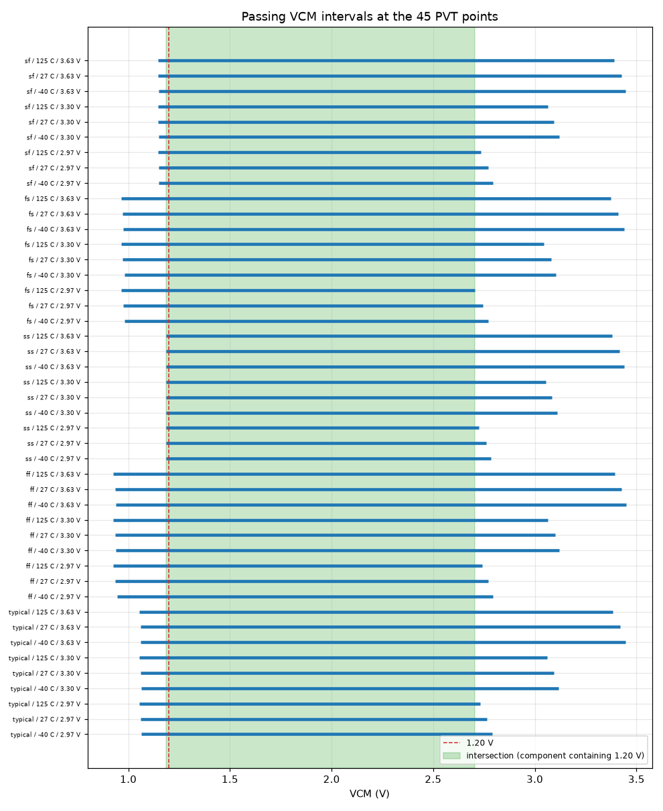
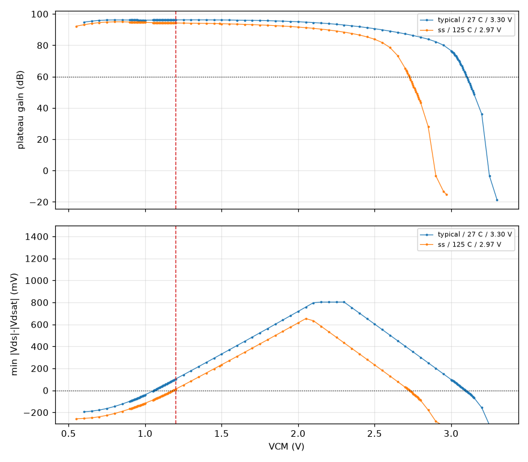

# Input common-mode range (ICMR) record `20261009-222613-871d1a6`

- **Date**: 2026-10-09 22:26 UTC; commit `871d1a6`; issue #60
- **DUT**: `design/netlist/opamp_two_stage.spice` (sha256 of the wrapper-normalised include `81fbd914f8254a49`), unchanged; snapshot `netlist-snapshots/20261009-222613-871d1a6.spice`
- **PDK revision**: gf180mcuD, open_pdks `c6d73a35f524070e85faff4a6a9eef49553ebc2b` (harness `find_pdk`, via volare-default); the local single units are pinned to it (`models.pdk_root`).
  - klt's `provenance.pdk` and `environment.models_lib_sha256` in the grid reports are resolved on the SUBMITTING CLIENT (open_pdks c6d73a35f524070e85faff4a6a9eef49553ebc2b (search root: ~/.volare)), not on the fleet runner, which uses its own install and (klt 0.5.0) does not report its revision. The fleet library is tied to the pinned revision indirectly: the local pinned units reproduce the grid's nominal point, and the scan's midrail samples reproduce the committed CMRR record (see Controls: midrail reproduction).
- **Tools**: ngspice local `ngspice-42 : Circuit level simulation program`, klt `klt 0.7.0+gb82427b30c96`, numpy `2.5.3`
- **Execution**: 4 `klt sim` corner requests (2 scan: one per excitation, crossing the 5 process corners x 3 temperatures with the paired VDD/VCM samples; 2 refinement over 1 round(s), one per excitation per round). Per request:
  - `scan-cm`: backend `aws-batch-fleet`, job `klt-sim-20c7b31c53a5`, Spot m7i.4xlarge, state `done`, runner klt `0.5.0` vs client `0.7.0+gb82427b30c96` (compatibility `mismatch`); engine `ngspice 46`; wall 2498 s
  - `scan-dm`: backend `aws-batch-fleet`, job `klt-sim-e40e856b6264`, Spot m7i.4xlarge, state `done`, runner klt `0.5.0` vs client `0.7.0+gb82427b30c96` (compatibility `mismatch`); engine `ngspice 46`; wall 2396 s
  - `refine1-dm`: backend `aws-batch-fleet`, job `klt-sim-366191c054aa`, Spot c7i.8xlarge, state `done`, runner klt `0.5.0` vs client `0.7.0+gb82427b30c96` (compatibility `mismatch`); engine `ngspice 46`; wall 5126 s
  - `refine1-cm`: backend `aws-batch-fleet`, job `klt-sim-d123d35f3dfc`, Spot c7i.8xlarge, state `done`, runner klt `0.5.0` vs client `0.7.0+gb82427b30c96` (compatibility `mismatch`); engine `ngspice 46`; wall 1691 s
  - Reports of `refine1-cm`, `refine1-dm`, `scan-cm`, `scan-dm` were reused from the `--keep-work` cache: byte-identical requests (netlist path aside) submitted by an earlier invocation of this driver on the same work directory; the job ids above are those submissions. Wall times are the original jobs'.
  - Local single units (controls) run with an empty `HOME` so no user `~/.spiceinit` applies (DR-0004).
- **Axes**: process typical, ff, ss, fs, sf; T -40 C, 27 C, 125 C; VDD 2.97 V, 3.30 V, 3.63 V; VCM scanned 0..VDD at <= 50 mV (explicit 1.20 V and VDD/2), transitions refined to <= 5 mV; ibias = 10 uA (ideal); CL = 2 pF. Every MOS corner uses `res_typical` + `mimcap_typical` (RZ/CC passive spread is NOT swept). `corners.supply_v` pairs `vdd` and `vcm` by index (each VDD repeated for each of its VCM samples).
- **Samples**: 6165 (PVT point, VCM) samples x 2 excitations: 3450 pass, 2245 fail, 470 invalid.

## Claim

**Measured, follower-biased ICMR of the schematic** (perfectly matched, passives at typical). It is the VCM range over which the input pair, tail, mirror and output stage stay saturated, the open-loop DC-plateau gain stays >= 60 dB and the follower output stays within 100 mV of VCM. It is not an arbitrary-output-voltage input range and not an offset-accuracy claim; the bench-validity tolerances (1 mV saturation tolerance, 0.10 V output tolerance) are not ratified performance bounds. Sampled coverage does not prove continuous behaviour between samples: endpoints are the nearest verified PASSING samples and the bracket to the adjacent non-passing sample is the stated uncertainty.

## Headline

- **Intersection over the 45 PVT points** (every contiguous component): [1.185, 2.705] V.
- **Component containing 1.20 V**: [1.185, 2.705] V; low endpoint 1.185 V set by ss / -40 C / 2.97 V (bracket 5 mV to a `fail` sample), high endpoint 2.705 V set by fs / 125 C / 2.97 V (bracket 5 mV to a `fail` sample).
- **1.20 V explicit sample at all 45 combinations**: **MEETS** (45 pass, 0 fail, 0 invalid/missing).
- Worst plateau gain at 1.20 V: 94.22 dB, limiting XM5 +11.7 mV at ss / 125 C / 2.97 V / VCM 1.200 V.
- Smallest device margin at 1.20 V: XM5 +11.1 mV (plateau gain 96.14 dB) at ss / -40 C / 2.97 V / VCM 1.200 V.
- Worst plateau gain inside the 1.20 V component (all 45 points, all samples in it): 60.93 dB, limiting XM6 +25.1 mV at fs / 125 C / 2.97 V / VCM 2.705 V.
- Smallest device margin inside that component: XM5 +0.6 mV (plateau gain 96.15 dB) at ss / -40 C / 2.97 V / VCM 1.185 V.

### Tolerance sensitivity (saturation tolerance 1 mV vs 0 mV)

- Intersection with the 1 mV tolerance: [1.185, 2.705] V; strict (0 mV): [1.185, 2.705] V.
- 1.20 V verdict with 1 mV: meets; strict: meets.
- Passing samples whose saturation margin is negative but inside the 1 mV tolerance: 15.
  - ff / -40 C / 3.30 V / VCM 0.940 V: XM5 (-0.854 mV)
  - ff / -40 C / 3.63 V / VCM 0.940 V: XM5 (-0.271 mV)
  - ff / 27 C / 2.97 V / VCM 0.935 V: XM5 (-0.128 mV)
  - ff / 125 C / 2.97 V / VCM 0.925 V: XM5 (-0.630 mV)
  - ff / 125 C / 3.30 V / VCM 0.925 V: XM5 (-0.037 mV)
  - fs / -40 C / 3.63 V / VCM 0.975 V: XM5 (-0.433 mV)
  - fs / 27 C / 3.30 V / VCM 0.970 V: XM5 (-0.714 mV)
  - fs / 27 C / 3.63 V / VCM 0.970 V: XM5 (-0.127 mV)
  - sf / -40 C / 2.97 V / VCM 2.795 V: XM6 (-0.531 mV)
  - sf / 27 C / 3.30 V / VCM 1.145 V: XM5 (-0.667 mV)
  - sf / 27 C / 3.63 V / VCM 1.145 V: XM5 (-0.092 mV)
  - ss / 27 C / 3.63 V / VCM 3.415 V: XM6 (-0.040 mV)
  - ss / 125 C / 3.30 V / VCM 3.055 V: XM6 (-0.393 mV)
  - typical / -40 C / 3.63 V / VCM 1.060 V: XM5 (-0.884 mV)
  - typical / 27 C / 3.30 V / VCM 3.095 V: XM6 (-0.839 mV)
- Interval endpoints (of 90) whose endpoint sample is inside the tolerance band: 15.

## Passing intervals at every PVT point

Every contiguous passing interval (adjacent valid passing samples; failed, invalid or missing samples are never bridged). Endpoints are the nearest passing samples; `unc` is the bracket to the adjacent non-passing sample (the true transition lies within it, on the non-passing side).

| PVT point | interval (V) | samples | low unc | low neighbour | high unc | high neighbour | 1.20 V | strict (0 mV) intervals |
|---|---|---|---|---|---|---|---|---|
| typical / -40 C / 2.97 V | [1.065, 2.790] V | 77 | 5 mV | fail | 5 mV | fail | pass | [1.065, 2.790] V |
| typical / 27 C / 2.97 V | [1.060, 2.765] V | 73 | 5 mV | fail | 5 mV | fail | pass | [1.060, 2.765] V |
| typical / 125 C / 2.97 V | [1.055, 2.730] V | 67 | 5 mV | fail | 5 mV | fail | pass | [1.055, 2.730] V |
| typical / -40 C / 3.30 V | [1.065, 3.115] V | 87 | 5 mV | fail | 5 mV | fail | pass | [1.065, 3.115] V |
| typical / 27 C / 3.30 V | [1.060, 3.095] V | 84 | 5 mV | fail | 5 mV | fail | pass | [1.060, 3.090] V |
| typical / 125 C / 3.30 V | [1.055, 3.060] V | 78 | 5 mV | fail | 5 mV | fail | pass | [1.055, 3.060] V |
| typical / -40 C / 3.63 V | [1.060, 3.445] V | 92 | 5 mV | fail | 5 mV | fail | pass | [1.065, 3.445] V |
| typical / 27 C / 3.63 V | [1.060, 3.420] V | 87 | 5 mV | fail | 5 mV | fail | pass | [1.060, 3.420] V |
| typical / 125 C / 3.63 V | [1.055, 3.385] V | 81 | 5 mV | fail | 5 mV | fail | pass | [1.055, 3.385] V |
| ff / -40 C / 2.97 V | [0.945, 2.795] V | 93 | 5 mV | fail | 5 mV | fail | pass | [0.945, 2.795] V |
| ff / 27 C / 2.97 V | [0.935, 2.770] V | 90 | 5 mV | fail | 5 mV | fail | pass | [0.940, 2.770] V |
| ff / 125 C / 2.97 V | [0.925, 2.740] V | 86 | 5 mV | fail | 5 mV | fail | pass | [0.930, 2.740] V |
| ff / -40 C / 3.30 V | [0.940, 3.120] V | 104 | 5 mV | fail | 5 mV | fail | pass | [0.945, 3.120] V |
| ff / 27 C / 3.30 V | [0.935, 3.100] V | 101 | 5 mV | fail | 5 mV | fail | pass | [0.935, 3.100] V |
| ff / 125 C / 3.30 V | [0.925, 3.065] V | 96 | 5 mV | fail | 5 mV | fail | pass | [0.930, 3.065] V |
| ff / -40 C / 3.63 V | [0.940, 3.450] V | 108 | 5 mV | fail | 5 mV | fail | pass | [0.945, 3.450] V |
| ff / 27 C / 3.63 V | [0.935, 3.425] V | 104 | 5 mV | fail | 5 mV | fail | pass | [0.935, 3.425] V |
| ff / 125 C / 3.63 V | [0.925, 3.395] V | 100 | 5 mV | fail | 5 mV | fail | pass | [0.925, 3.395] V |
| ss / -40 C / 2.97 V | [1.185, 2.785] V | 52 | 5 mV | fail | 5 mV | fail | pass | [1.185, 2.785] V |
| ss / 27 C / 2.97 V | [1.185, 2.760] V | 47 | 5 mV | fail | 5 mV | fail | pass | [1.185, 2.760] V |
| ss / 125 C / 2.97 V | [1.185, 2.725] V | 40 | 5 mV | fail | 5 mV | fail | pass | [1.185, 2.725] V |
| ss / -40 C / 3.30 V | [1.185, 3.110] V | 62 | 5 mV | fail | 5 mV | fail | pass | [1.185, 3.110] V |
| ss / 27 C / 3.30 V | [1.185, 3.085] V | 57 | 5 mV | fail | 5 mV | fail | pass | [1.185, 3.085] V |
| ss / 125 C / 3.30 V | [1.185, 3.055] V | 51 | 5 mV | fail | 5 mV | fail | pass | [1.185, 3.050] V |
| ss / -40 C / 3.63 V | [1.185, 3.440] V | 66 | 5 mV | fail | 5 mV | fail | pass | [1.185, 3.440] V |
| ss / 27 C / 3.63 V | [1.185, 3.415] V | 61 | 5 mV | fail | 5 mV | fail | pass | [1.185, 3.410] V |
| ss / 125 C / 3.63 V | [1.185, 3.380] V | 54 | 5 mV | fail | 5 mV | fail | pass | [1.185, 3.380] V |
| fs / -40 C / 2.97 V | [0.980, 2.770] V | 81 | 5 mV | fail | 5 mV | fail | pass | [0.980, 2.770] V |
| fs / 27 C / 2.97 V | [0.975, 2.745] V | 77 | 5 mV | fail | 5 mV | fail | pass | [0.975, 2.745] V |
| fs / 125 C / 2.97 V | [0.965, 2.705] V | 71 | 5 mV | fail | 5 mV | fail | pass | [0.965, 2.705] V |
| fs / -40 C / 3.30 V | [0.980, 3.105] V | 93 | 5 mV | fail | 5 mV | fail | pass | [0.980, 3.105] V |
| fs / 27 C / 3.30 V | [0.970, 3.080] V | 90 | 5 mV | fail | 5 mV | fail | pass | [0.975, 3.080] V |
| fs / 125 C / 3.30 V | [0.965, 3.045] V | 84 | 5 mV | fail | 5 mV | fail | pass | [0.965, 3.045] V |
| fs / -40 C / 3.63 V | [0.975, 3.440] V | 99 | 5 mV | fail | 5 mV | fail | pass | [0.980, 3.440] V |
| fs / 27 C / 3.63 V | [0.970, 3.410] V | 94 | 5 mV | fail | 5 mV | fail | pass | [0.975, 3.410] V |
| fs / 125 C / 3.63 V | [0.965, 3.375] V | 88 | 5 mV | fail | 5 mV | fail | pass | [0.965, 3.375] V |
| sf / -40 C / 2.97 V | [1.150, 2.795] V | 61 | 5 mV | fail | 5 mV | fail | pass | [1.150, 2.790] V |
| sf / 27 C / 2.97 V | [1.150, 2.770] V | 56 | 5 mV | fail | 5 mV | fail | pass | [1.150, 2.770] V |
| sf / 125 C / 2.97 V | [1.145, 2.735] V | 50 | 5 mV | fail | 5 mV | fail | pass | [1.145, 2.735] V |
| sf / -40 C / 3.30 V | [1.150, 3.120] V | 71 | 5 mV | fail | 5 mV | fail | pass | [1.150, 3.120] V |
| sf / 27 C / 3.30 V | [1.145, 3.095] V | 67 | 5 mV | fail | 5 mV | fail | pass | [1.150, 3.095] V |
| sf / 125 C / 3.30 V | [1.145, 3.065] V | 61 | 5 mV | fail | 5 mV | fail | pass | [1.145, 3.065] V |
| sf / -40 C / 3.63 V | [1.150, 3.445] V | 74 | 5 mV | fail | 5 mV | fail | pass | [1.150, 3.445] V |
| sf / 27 C / 3.63 V | [1.145, 3.425] V | 71 | 5 mV | fail | 5 mV | fail | pass | [1.150, 3.425] V |
| sf / 125 C / 3.63 V | [1.145, 3.390] V | 64 | 5 mV | fail | 5 mV | fail | pass | [1.145, 3.390] V |

## Explicit 1.20 V samples

| PVT point | status | plateau gain (dB) | limiting device | margin (mV) | vout - VCM (mV) | reasons |
|---|---|---|---|---|---|---|
| typical / -40 C / 2.97 V | pass | 96.39 | XM5 | +100.3 | -0.032 |  |
| typical / 27 C / 2.97 V | pass | 95.61 | XM5 | +103.4 | -0.016 |  |
| typical / 125 C / 2.97 V | pass | 94.50 | XM5 | +107.3 | +0.009 |  |
| typical / -40 C / 3.30 V | pass | 96.93 | XM5 | +100.9 | -0.030 |  |
| typical / 27 C / 3.30 V | pass | 96.20 | XM5 | +104.1 | -0.014 |  |
| typical / 125 C / 3.30 V | pass | 95.14 | XM5 | +107.9 | +0.012 |  |
| typical / -40 C / 3.63 V | pass | 96.98 | XM5 | +101.6 | -0.028 |  |
| typical / 27 C / 3.63 V | pass | 96.28 | XM5 | +104.7 | -0.012 |  |
| typical / 125 C / 3.63 V | pass | 95.26 | XM5 | +108.5 | +0.015 |  |
| ff / -40 C / 2.97 V | pass | 96.54 | XM5 | +193.3 | -0.029 |  |
| ff / 27 C / 2.97 V | pass | 95.72 | XM5 | +199.0 | -0.012 |  |
| ff / 125 C / 2.97 V | pass | 94.52 | XM5 | +206.6 | +0.014 |  |
| ff / -40 C / 3.30 V | pass | 97.03 | XM5 | +193.9 | -0.027 |  |
| ff / 27 C / 3.30 V | pass | 96.26 | XM5 | +199.6 | -0.010 |  |
| ff / 125 C / 3.30 V | pass | 95.11 | XM5 | +207.2 | +0.017 |  |
| ff / -40 C / 3.63 V | pass | 97.00 | XM5 | +194.6 | -0.025 |  |
| ff / 27 C / 3.63 V | pass | 96.25 | XM5 | +200.2 | -0.008 |  |
| ff / 125 C / 3.63 V | pass | 95.14 | XM5 | +207.8 | +0.021 |  |
| ss / -40 C / 2.97 V | pass | 96.14 | XM5 | +11.1 | -0.043 |  |
| ss / 27 C / 2.97 V | pass | 95.34 | XM5 | +11.7 | -0.028 |  |
| ss / 125 C / 2.97 V | pass | 94.22 | XM5 | +11.7 | -0.003 |  |
| ss / -40 C / 3.30 V | pass | 96.73 | XM5 | +11.8 | -0.040 |  |
| ss / 27 C / 3.30 V | pass | 95.99 | XM5 | +12.3 | -0.024 |  |
| ss / 125 C / 3.30 V | pass | 94.93 | XM5 | +12.3 | +0.000 |  |
| ss / -40 C / 3.63 V | pass | 96.87 | XM5 | +12.3 | -0.039 |  |
| ss / 27 C / 3.63 V | pass | 96.16 | XM5 | +12.9 | -0.022 |  |
| ss / 125 C / 3.63 V | pass | 95.14 | XM5 | +12.9 | +0.003 |  |
| fs / -40 C / 2.97 V | pass | 96.32 | XM5 | +165.4 | -0.032 |  |
| fs / 27 C / 2.97 V | pass | 95.58 | XM5 | +170.0 | -0.016 |  |
| fs / 125 C / 2.97 V | pass | 94.52 | XM5 | +175.9 | +0.009 |  |
| fs / -40 C / 3.30 V | pass | 96.96 | XM5 | +166.1 | -0.029 |  |
| fs / 27 C / 3.30 V | pass | 96.27 | XM5 | +170.6 | -0.013 |  |
| fs / 125 C / 3.30 V | pass | 95.28 | XM5 | +176.6 | +0.012 |  |
| fs / -40 C / 3.63 V | pass | 97.21 | XM5 | +166.7 | -0.028 |  |
| fs / 27 C / 3.63 V | pass | 96.57 | XM5 | +171.2 | -0.011 |  |
| fs / 125 C / 3.63 V | pass | 95.62 | XM5 | +177.2 | +0.015 |  |
| sf / -40 C / 2.97 V | pass | 96.37 | XM5 | +36.6 | -0.035 |  |
| sf / 27 C / 2.97 V | pass | 95.52 | XM5 | +38.3 | -0.019 |  |
| sf / 125 C / 2.97 V | pass | 94.31 | XM5 | +39.9 | +0.006 |  |
| sf / -40 C / 3.30 V | pass | 96.78 | XM5 | +37.2 | -0.033 |  |
| sf / 27 C / 3.30 V | pass | 95.98 | XM5 | +38.9 | -0.017 |  |
| sf / 125 C / 3.30 V | pass | 94.81 | XM5 | +40.6 | +0.009 |  |
| sf / -40 C / 3.63 V | pass | 96.58 | XM5 | +37.8 | -0.032 |  |
| sf / 27 C / 3.63 V | pass | 95.79 | XM5 | +39.5 | -0.015 |  |
| sf / 125 C / 3.63 V | pass | 94.64 | XM5 | +41.2 | +0.014 |  |

## Validity failures (preserved)

- 470 invalid sample(s) of 6165. Invalid samples are never passing and never bridged; they are listed in `corners/<rid>/samples.csv` with their reasons.
  - 469 x no Ad plateau over ## Hz: varies by # dB (> # dB)
  - 1 x Ad plateau phase # deg is not ~# (wrong polarity)

## Method

- Per sample and excitation: `.ac dec 20 0.1 10` (41 points), then an `op` of the same deck whose printout (vout, vinp, vinn and every DUT MOSFET's vds, vdsat, id) is retained in the log (`analysis.args`, no fleet expression-measurement support needed). `dm`: vinp +0.5 V, vinn -0.5 V AC; `cm`: vinp = vinn = 1 V AC; same DC common mode.
- The DC loop is closed by the CMRR bench's ideal servo (`Esb` buffer -> `Rsv`/`Csv`, tau = 1e18 s -> `Esv` in series with the vinn AC source): a unity-gain-follower operating point at DC and an open loop at every swept frequency. Closed-loop follower gain is not what is measured. From the ACTUAL input phasors the two runs are solved jointly for Ad and Acm per frequency (the CMRR driver's exact solve).
- **Plateau gain** = the minimum of |Ad| (dB) over 0.1-1 Hz, valid only if |Ad| is flat there to 0.1 dB and has ~0 deg phase (a DC-plateau gain, not an exact zero-frequency measurement).
- **Saturation**: |Vds| - |Vdsat| >= -1 mV for the input pair (XM1, XM2), tail (XM5), mirror (XM3, XM4) and output stage (XM6, XM7); XM-B1 (the bias reference) is retained in the log and CSV but is not part of the criterion. Negative margins inside the tolerance are flagged; the analysis is repeated with 0 mV.
- **Rejected as INVALID**: missing/non-finite fields, an analysis that did not complete, incorrect AC excitation (differential within 1e-06 V of vd = 1, vc = 0; common mode within 1e-06 V of vc = 1 with |vd/vc| <= 1e-06), paired operating points disagreeing by > 1 uV, v(vinp) not at VCM, or no Ad plateau. **FAIL**: gain below 60 dB, |vout - VCM| > 100 mV, a device below saturation by more than the tolerance, or zero (< 1e-09 A) input-pair/tail current.
- **Refinement**: every adjacent pass/non-pass pair further apart than 5 mV is filled at 5 mV spacing by additional paired batch requests (1 round(s)); each round's request crosses the union of the needed (VDD, VCM) pairs with every process corner that needed one and every temperature, and all returned samples are kept.

## Controls

- **Nominal local unit** (typical / 27 C / 3.30 V, VCM 1.650 V): plateau gain 95.989 dB (min 95.988 dB).
- Local nominal unit vs the scan's nominal midrail sample: 0.0000 dB (tolerance 0.05 dB).
- **Midrail reproduction** of the committed CMRR record `20261009-105631-30ec86d` (mean Ad over 0.1-1 Hz at VDD/2): 45/45 points compared; max deviation 0.0000 dB at ss / 125 C / 2.97 V; nominal point 0.0000 dB (tolerance 0.05 dB).
- **Servo isolation**, servo tau = 1e+16 s: plateau gain moves 0.00000 dB (tolerance 0.01 dB).
- **Servo isolation**, servo tau = 1e+20 s: plateau gain moves 0.00000 dB (tolerance 0.01 dB).
- **Inadequate servo** (tau = 0.001 s): REJECTED (differential excitation off by 1 V (> 1e-06): servo isolation or wiring).
- **Unequal common-mode drive** (acp = 1, acn = 0.99): REJECTED (common-mode excitation off by 0.005 V (> 1e-06)).

## Independent recomputation

- After writing, every sample was re-derived from the RETAINED archives (24660 rawfile/log members in `corners/20261009-222613-871d1a6/data/`) through a separate read path (`--recompute 20261009-222613-871d1a6` repeats it) and compared with `samples.csv` (status, gain, margin) and with the headline numbers above: **identical**.

## Plots




## Reproduce / evidence

```
python3 sim/input-common-mode/run_input_common_mode.py            # full scan + refinement + a new record
python3 sim/input-common-mode/run_input_common_mode.py --smoke    # nominal point, local, no record
python3 sim/input-common-mode/run_input_common_mode.py --recompute 20261009-222613-871d1a6
```

- `corners/20261009-222613-871d1a6/samples.csv` (every sample, with margins and currents of every MOSFET), `corners/20261009-222613-871d1a6/data/*.tar.gz` (retained `.raw` and `.log` per sample and excitation), `corners/20261009-222613-871d1a6/requests/*.json.gz` and `reports/*.json.gz` (every klt request and sanitised report), `corners/20261009-222613-871d1a6/controls/` (local control logs).
- Testbench `sim/input-common-mode/testbench/tb_input_common_mode.spice`; driver `sim/input-common-mode/run_input_common_mode.py`; tests `sim/input-common-mode/test_input_common_mode.py`.
- Timestamp / author: 2026-10-09T22:26:13Z, agent-builder (issue #60)
