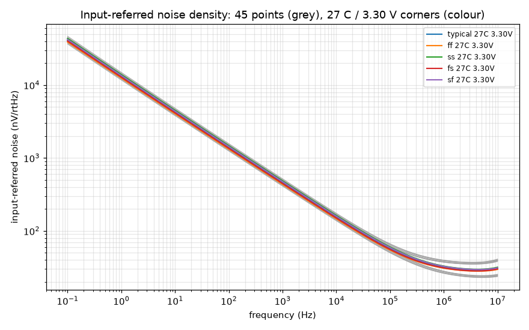
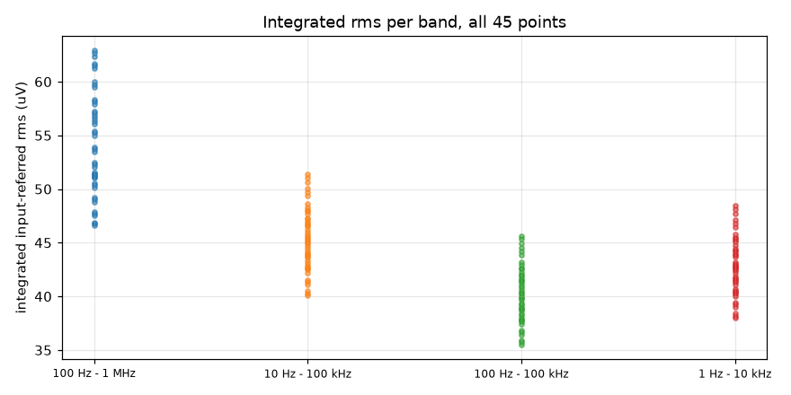

# Noise record `20261009-082007-68b4567`

- **Date**: 2026-10-09 08:20 UTC; commit `68b4567`; issue #46
- **DUT**: `design/netlist/opamp_two_stage.spice` (sha256 of the wrapper-normalised include `81fbd914f8254a49`), unchanged
- **PDK**: gf180mcuD (open_pdks `c6d73a35f524070e85faff4a6a9eef49553ebc2b`); tools: ngspice local `ngspice-42 : Circuit level simulation program`, klt `klt 0.7.0+g4cbdfa769875`
- **Execution**: `klt sim` backend `aws-batch-fleet`, job `klt-sim-e9d5b5e1f70d`, Spot m7i.4xlarge; runner klt `0.5.0` vs client `0.7.0+g4cbdfa769875`
- **Request**: the 45-point grid (5 MOS corners x 3 T x 3 VDD, vcm = VDD/2) as ONE `klt sim` request, `.noise v(vout) Vcm dec 20 0.1 1e+07`, wall time 334 s (client-side)
- **Passive sections**: every corner uses `res_typical` + `mimcap_typical`; RZ/CC passive spread is NOT swept.

## Claim

**Measured, no pass or fail verdict: the row's bound is not ratified** (DR-3 residual (e1)); neither is the integration band. The bands below are candidates so the choice can be argued from data. `spec/target-spec.md` is untouched.

## Flicker (1/f) noise is modelled and visible

**Not thermal-only.** The 1/f term exceeds the thermal floor by >= 10x at 1 Hz at all 45 points; the fitted 1/f corner and floor are reported below. A figure rated against the row may therefore use the flicker-inclusive numbers.

### Model audit (pinned library, read by the driver)

- Library `sm141064.ngspice`, open_pdks `c6d73a35f524070e85faff4a6a9eef49553ebc2b`; `fnoicor = 0` in `design.ngspice` (0 = as-extracted, 1 = worst-case flicker).
- Corner sections that pull in `.lib noise_corner`: `typical` yes, `ff` yes, `ss` yes, `fs` yes, `sf` yes.
  - `nfet_03v3_noia` = `(fnoicor==0)*3.2e+041 + (fnoicor==1)*3.5e+042`
  - `nfet_03v3_noib` = `(fnoicor==0)*1.2e+020 + (fnoicor==1)*1.2e+020`
  - `nfet_03v3_noic` = `(fnoicor==0)*6.0e+008 + (fnoicor==1)*6.0e+008`
  - `pfet_03v3_noia` = `(fnoicor==0)*3.2e+041 + (fnoicor==1)*4.0e+042`
  - `pfet_03v3_noib` = `(fnoicor==0)*1.8e+020 + (fnoicor==1)*1.8e+020`
  - `pfet_03v3_noic` = `(fnoicor==0)*3.0e+009 + (fnoicor==1)*6.0e+009`

| model | .model cards | fnoimod | ef | noia | noib | noic |
|---|---|---|---|---|---|---|
| `nfet_03v3` | 96 | 1 | 0.95 | nfet_03v3_noia | nfet_03v3_noib | nfet_03v3_noic |
| `pfet_03v3` | 96 | 1 | 1.12 | pfet_03v3_noia | pfet_03v3_noib | pfet_03v3_noic |

`fnoimod = 1` selects the BSIM4 unified flicker model (`noia/noib/noic`, exponent `ef`), so MOS flicker noise is part of every `.noise` run; thermal noise is on by default and the resistor RZ contributes thermal noise only.

## Nominal point (typical, 27 C, 3.30 V)

| quantity | value |
|---|---|
| density @ 10 Hz | 4274.60 nV/rtHz |
| density @ 100 Hz | 1397.48 nV/rtHz |
| density @ 1000 Hz | 460.81 nV/rtHz |
| density @ 10000 Hz | 154.62 nV/rtHz |
| density @ 100000 Hz | 57.32 nV/rtHz |
| rms 100 Hz - 1 MHz | 53.727 uV |
| rms 10 Hz - 100 kHz | 45.224 uV |
| rms 100 Hz - 100 kHz | 40.135 uV |
| rms 1 Hz - 10 kHz | 42.771 uV |
| thermal floor | 27.94 nV/rtHz |
| 1/f corner | 323.2 kHz |

## Spot densities (nV/rtHz, input-referred) -- all points

| point | 10 Hz | 100 Hz | 1000 Hz | 10000 Hz | 100000 Hz |
|---|---|---|---|---|---|
| ff / -40 C / 2.97 V | 3794.47 | 1241.51 | 409.51 | 137.11 | 49.87 |
| ff / -40 C / 3.30 V | 3815.43 | 1248.85 | 412.04 | 137.94 | 50.07 |
| ff / -40 C / 3.63 V | 3833.90 | 1255.33 | 414.27 | 138.67 | 50.25 |
| ff / 27 C / 2.97 V | 4019.32 | 1313.52 | 433.06 | 145.46 | 54.39 |
| ff / 27 C / 3.30 V | 4044.22 | 1322.17 | 436.02 | 146.43 | 54.61 |
| ff / 27 C / 3.63 V | 4066.31 | 1329.84 | 438.64 | 147.29 | 54.81 |
| ff / 125 C / 2.97 V | 4266.79 | 1391.82 | 458.53 | 154.78 | 60.16 |
| ff / 125 C / 3.30 V | 4294.05 | 1401.24 | 461.74 | 155.82 | 60.39 |
| ff / 125 C / 3.63 V | 4318.44 | 1409.66 | 464.61 | 156.75 | 60.60 |
| fs / -40 C / 2.97 V | 3899.53 | 1274.58 | 420.08 | 140.50 | 50.91 |
| fs / -40 C / 3.30 V | 3922.62 | 1282.68 | 422.87 | 141.42 | 51.13 |
| fs / -40 C / 3.63 V | 3942.93 | 1289.81 | 425.33 | 142.24 | 51.33 |
| fs / 27 C / 2.97 V | 4133.64 | 1349.63 | 444.63 | 149.17 | 55.50 |
| fs / 27 C / 3.30 V | 4160.98 | 1359.14 | 447.88 | 150.24 | 55.75 |
| fs / 27 C / 3.63 V | 4185.16 | 1367.55 | 450.77 | 151.19 | 55.98 |
| fs / 125 C / 2.97 V | 4391.15 | 1431.22 | 471.18 | 158.82 | 61.34 |
| fs / 125 C / 3.30 V | 4421.14 | 1441.59 | 474.71 | 159.98 | 61.60 |
| fs / 125 C / 3.63 V | 4447.87 | 1450.84 | 477.87 | 161.00 | 61.83 |
| sf / -40 C / 2.97 V | 4108.33 | 1344.84 | 443.71 | 148.49 | 53.74 |
| sf / -40 C / 3.30 V | 4134.53 | 1353.98 | 446.85 | 149.53 | 54.00 |
| sf / -40 C / 3.63 V | 4157.36 | 1361.95 | 449.59 | 150.43 | 54.22 |
| sf / 27 C / 2.97 V | 4361.45 | 1426.23 | 470.39 | 157.89 | 58.63 |
| sf / 27 C / 3.30 V | 4392.86 | 1437.10 | 474.10 | 159.11 | 58.93 |
| sf / 27 C / 3.63 V | 4420.45 | 1446.64 | 477.36 | 160.18 | 59.19 |
| sf / 125 C / 2.97 V | 4643.70 | 1516.01 | 499.67 | 168.49 | 64.89 |
| sf / 125 C / 3.30 V | 4678.33 | 1527.93 | 503.72 | 169.81 | 65.20 |
| sf / 125 C / 3.63 V | 4709.05 | 1538.51 | 507.32 | 170.98 | 65.47 |
| ss / -40 C / 2.97 V | 4218.51 | 1379.12 | 454.57 | 151.96 | 54.80 |
| ss / -40 C / 3.30 V | 4246.95 | 1389.05 | 457.99 | 153.09 | 55.09 |
| ss / -40 C / 3.63 V | 4271.78 | 1397.74 | 460.98 | 154.08 | 55.34 |
| ss / 27 C / 2.97 V | 4482.30 | 1463.97 | 482.38 | 161.72 | 59.78 |
| ss / 27 C / 3.30 V | 4516.33 | 1475.76 | 486.40 | 163.05 | 60.11 |
| ss / 27 C / 3.63 V | 4546.21 | 1486.12 | 489.95 | 164.21 | 60.41 |
| ss / 125 C / 2.97 V | 4776.63 | 1557.68 | 512.94 | 172.72 | 66.13 |
| ss / 125 C / 3.30 V | 4814.26 | 1570.65 | 517.35 | 174.16 | 66.48 |
| ss / 125 C / 3.63 V | 4847.58 | 1582.14 | 521.27 | 175.44 | 66.78 |
| typical / -40 C / 2.97 V | 4002.39 | 1309.32 | 431.80 | 144.46 | 52.31 |
| typical / -40 C / 3.30 V | 4026.87 | 1317.88 | 434.74 | 145.44 | 52.55 |
| typical / -40 C / 3.63 V | 4048.39 | 1325.42 | 437.33 | 146.30 | 52.76 |
| typical / 27 C / 2.97 V | 4245.43 | 1387.36 | 457.35 | 153.48 | 57.04 |
| typical / 27 C / 3.30 V | 4274.60 | 1397.48 | 460.81 | 154.62 | 57.32 |
| typical / 27 C / 3.63 V | 4300.39 | 1406.43 | 463.87 | 155.63 | 57.56 |
| typical / 125 C / 2.97 V | 4514.52 | 1472.80 | 485.19 | 163.58 | 63.08 |
| typical / 125 C / 3.30 V | 4546.60 | 1483.86 | 488.95 | 164.81 | 63.37 |
| typical / 125 C / 3.63 V | 4575.20 | 1493.73 | 492.32 | 165.90 | 63.62 |

## Integrated input-referred rms (uV) -- all points

Exact piecewise power-law integration of density^2 between sweep points.

| point | 100 Hz - 1 MHz | 10 Hz - 100 kHz | 100 Hz - 100 kHz | 1 Hz - 10 kHz |
|---|---|---|---|---|
| ff / -40 C / 2.97 V | 46.586 | 40.061 | 35.529 | 37.981 |
| ff / -40 C / 3.30 V | 46.750 | 40.293 | 35.735 | 38.203 |
| ff / -40 C / 3.63 V | 46.891 | 40.498 | 35.917 | 38.398 |
| ff / 27 C / 2.97 V | 51.056 | 42.564 | 37.786 | 40.209 |
| ff / 27 C / 3.30 V | 51.243 | 42.835 | 38.027 | 40.471 |
| ff / 27 C / 3.63 V | 51.405 | 43.076 | 38.239 | 40.702 |
| ff / 125 C / 2.97 V | 56.853 | 45.391 | 40.355 | 42.647 |
| ff / 125 C / 3.30 V | 57.039 | 45.682 | 40.612 | 42.932 |
| ff / 125 C / 3.63 V | 57.202 | 45.943 | 40.842 | 43.186 |
| fs / -40 C / 2.97 V | 47.540 | 41.073 | 36.408 | 38.994 |
| fs / -40 C / 3.30 V | 47.727 | 41.330 | 36.637 | 39.238 |
| fs / -40 C / 3.63 V | 47.890 | 41.557 | 36.839 | 39.454 |
| fs / 27 C / 2.97 V | 52.077 | 43.668 | 38.746 | 41.314 |
| fs / 27 C / 3.30 V | 52.289 | 43.967 | 39.011 | 41.601 |
| fs / 27 C / 3.63 V | 52.474 | 44.232 | 39.246 | 41.856 |
| fs / 125 C / 2.97 V | 57.932 | 46.591 | 41.398 | 43.852 |
| fs / 125 C / 3.30 V | 58.144 | 46.913 | 41.682 | 44.165 |
| fs / 125 C / 3.63 V | 58.331 | 47.200 | 41.936 | 44.444 |
| sf / -40 C / 2.97 V | 50.143 | 43.369 | 38.459 | 41.136 |
| sf / -40 C / 3.30 V | 50.358 | 43.659 | 38.716 | 41.413 |
| sf / -40 C / 3.63 V | 50.544 | 43.912 | 38.941 | 41.654 |
| sf / 27 C / 2.97 V | 54.966 | 46.176 | 40.986 | 43.651 |
| sf / 27 C / 3.30 V | 55.216 | 46.518 | 41.289 | 43.980 |
| sf / 27 C / 3.63 V | 55.434 | 46.819 | 41.556 | 44.268 |
| sf / 125 C / 2.97 V | 61.219 | 49.375 | 43.886 | 46.440 |
| sf / 125 C / 3.30 V | 61.476 | 49.746 | 44.214 | 46.800 |
| sf / 125 C / 3.63 V | 61.702 | 50.075 | 44.505 | 47.120 |
| ss / -40 C / 2.97 V | 51.130 | 44.411 | 39.361 | 42.187 |
| ss / -40 C / 3.30 V | 51.371 | 44.728 | 39.643 | 42.488 |
| ss / -40 C / 3.63 V | 51.580 | 45.004 | 39.889 | 42.751 |
| ss / 27 C / 2.97 V | 56.033 | 47.323 | 41.979 | 44.807 |
| ss / 27 C / 3.30 V | 56.311 | 47.695 | 42.310 | 45.164 |
| ss / 27 C / 3.63 V | 56.554 | 48.022 | 42.601 | 45.477 |
| ss / 125 C / 2.97 V | 62.364 | 50.637 | 44.980 | 47.715 |
| ss / 125 C / 3.30 V | 62.650 | 51.043 | 45.338 | 48.108 |
| ss / 125 C / 3.63 V | 62.902 | 51.402 | 45.656 | 48.455 |
| typical / -40 C / 2.97 V | 48.825 | 42.211 | 37.425 | 40.053 |
| typical / -40 C / 3.30 V | 49.025 | 42.482 | 37.667 | 40.311 |
| typical / -40 C / 3.63 V | 49.199 | 42.721 | 37.879 | 40.539 |
| typical / 27 C / 2.97 V | 53.498 | 44.906 | 39.852 | 42.465 |
| typical / 27 C / 3.30 V | 53.727 | 45.224 | 40.135 | 42.771 |
| typical / 27 C / 3.63 V | 53.928 | 45.506 | 40.384 | 43.041 |
| typical / 125 C / 2.97 V | 59.541 | 47.958 | 42.621 | 45.120 |
| typical / 125 C / 3.30 V | 59.774 | 48.302 | 42.925 | 45.455 |
| typical / 125 C / 3.63 V | 59.980 | 48.609 | 43.196 | 45.753 |

Spread across the grid (min .. max):

- 100 Hz - 1 MHz: 46.586 uV (ff / -40 C / 2.97 V) .. 62.902 uV (ss / 125 C / 3.63 V); max/min = 1.35
- 10 Hz - 100 kHz: 40.061 uV (ff / -40 C / 2.97 V) .. 51.402 uV (ss / 125 C / 3.63 V); max/min = 1.28
- 100 Hz - 100 kHz: 35.529 uV (ff / -40 C / 2.97 V) .. 45.656 uV (ss / 125 C / 3.63 V); max/min = 1.29
- 1 Hz - 10 kHz: 37.981 uV (ff / -40 C / 2.97 V) .. 48.455 uV (ss / 125 C / 3.63 V); max/min = 1.28

## Thermal floor and 1/f corner

Method: least-squares fit of S(f) = Sw + K / f^a to the density^2 over 1 Hz - 1e+07 Hz with relative-error weights (exponent `a` scanned 0.5..1.5, step 0.005, Sw and K from linear least squares). Thermal floor = sqrt(Sw); corner = (K/Sw)^(1/a), where the 1/f power equals the thermal power. A fit is reported only when its rms relative residual of S is <= 5%.

| point | floor (nV/rtHz) | corner (kHz) | a | K/Sw at 1 Hz | fit resid |
|---|---|---|---|---|---|
| ff / -40 C / 2.97 V | 22.06 | 428.5 | 0.965 | 2.72e+05 | 1.73% |
| ff / -40 C / 3.30 V | 21.91 | 439.9 | 0.965 | 2.79e+05 | 1.70% |
| ff / -40 C / 3.63 V | 21.78 | 450.6 | 0.965 | 2.86e+05 | 1.68% |
| ff / 27 C / 2.97 V | 27.34 | 297.3 | 0.970 | 2.04e+05 | 2.18% |
| ff / 27 C / 3.30 V | 27.20 | 304.6 | 0.970 | 2.09e+05 | 2.19% |
| ff / 27 C / 3.63 V | 26.89 | 327.5 | 0.965 | 2.1e+05 | 2.17% |
| ff / 125 C / 2.97 V | 34.29 | 209.6 | 0.970 | 1.45e+05 | 2.73% |
| ff / 125 C / 3.30 V | 34.16 | 214.3 | 0.970 | 1.48e+05 | 2.73% |
| ff / 125 C / 3.63 V | 34.03 | 218.6 | 0.970 | 1.51e+05 | 2.73% |
| fs / -40 C / 2.97 V | 22.16 | 448.0 | 0.965 | 2.84e+05 | 1.98% |
| fs / -40 C / 3.30 V | 22.01 | 460.6 | 0.965 | 2.92e+05 | 1.95% |
| fs / -40 C / 3.63 V | 21.86 | 472.3 | 0.965 | 2.99e+05 | 1.92% |
| fs / 27 C / 2.97 V | 27.49 | 310.9 | 0.970 | 2.13e+05 | 2.38% |
| fs / 27 C / 3.30 V | 27.34 | 319.0 | 0.970 | 2.18e+05 | 2.38% |
| fs / 27 C / 3.63 V | 27.20 | 326.5 | 0.970 | 2.23e+05 | 2.40% |
| fs / 125 C / 2.97 V | 34.49 | 219.3 | 0.970 | 1.52e+05 | 3.06% |
| fs / 125 C / 3.30 V | 34.34 | 224.6 | 0.970 | 1.55e+05 | 3.05% |
| fs / 125 C / 3.63 V | 34.21 | 229.4 | 0.970 | 1.58e+05 | 3.05% |
| sf / -40 C / 2.97 V | 23.16 | 457.5 | 0.965 | 2.9e+05 | 1.72% |
| sf / -40 C / 3.30 V | 22.99 | 470.9 | 0.965 | 2.98e+05 | 1.70% |
| sf / -40 C / 3.63 V | 22.84 | 483.2 | 0.965 | 3.06e+05 | 1.68% |
| sf / 27 C / 2.97 V | 28.53 | 334.9 | 0.965 | 2.15e+05 | 2.21% |
| sf / 27 C / 3.30 V | 28.37 | 344.1 | 0.965 | 2.2e+05 | 2.18% |
| sf / 27 C / 3.63 V | 28.23 | 352.6 | 0.965 | 2.25e+05 | 2.15% |
| sf / 125 C / 2.97 V | 36.08 | 225.2 | 0.970 | 1.56e+05 | 2.76% |
| sf / 125 C / 3.30 V | 35.93 | 230.8 | 0.970 | 1.59e+05 | 2.76% |
| sf / 125 C / 3.63 V | 35.80 | 235.9 | 0.970 | 1.63e+05 | 2.76% |
| ss / -40 C / 2.97 V | 23.27 | 476.6 | 0.965 | 3.02e+05 | 1.99% |
| ss / -40 C / 3.30 V | 23.10 | 491.2 | 0.965 | 3.11e+05 | 1.95% |
| ss / -40 C / 3.63 V | 22.95 | 504.7 | 0.965 | 3.19e+05 | 1.92% |
| ss / 27 C / 2.97 V | 28.89 | 332.0 | 0.970 | 2.27e+05 | 2.41% |
| ss / 27 C / 3.30 V | 28.73 | 341.4 | 0.970 | 2.33e+05 | 2.42% |
| ss / 27 C / 3.63 V | 28.58 | 350.1 | 0.970 | 2.39e+05 | 2.44% |
| ss / 125 C / 2.97 V | 36.29 | 235.1 | 0.970 | 1.62e+05 | 3.08% |
| ss / 125 C / 3.30 V | 36.14 | 241.3 | 0.970 | 1.66e+05 | 3.07% |
| ss / 125 C / 3.63 V | 36.00 | 247.0 | 0.970 | 1.7e+05 | 3.07% |
| typical / -40 C / 2.97 V | 22.64 | 453.3 | 0.965 | 2.87e+05 | 1.84% |
| typical / -40 C / 3.30 V | 22.48 | 466.3 | 0.965 | 2.95e+05 | 1.81% |
| typical / -40 C / 3.63 V | 22.34 | 478.3 | 0.965 | 3.03e+05 | 1.79% |
| typical / 27 C / 2.97 V | 28.08 | 314.9 | 0.970 | 2.15e+05 | 2.30% |
| typical / 27 C / 3.30 V | 27.94 | 323.2 | 0.970 | 2.21e+05 | 2.31% |
| typical / 27 C / 3.63 V | 27.60 | 348.3 | 0.965 | 2.23e+05 | 2.30% |
| typical / 125 C / 2.97 V | 35.25 | 222.4 | 0.970 | 1.54e+05 | 2.90% |
| typical / 125 C / 3.30 V | 35.11 | 227.8 | 0.970 | 1.57e+05 | 2.90% |
| typical / 125 C / 3.63 V | 34.98 | 232.8 | 0.970 | 1.61e+05 | 2.90% |

Over 45 fitted points: floor 21.78 .. 36.29 nV/rtHz; corner 209.6 .. 504.7 kHz.

## Extraction validation

- **Output total**: our integral of `onoise_spectrum` vs ngspice `onoise_total` (printed in each point's log): max |dev| = 0.000% (tolerance 0.5%).
- **Input total**: our integral of `inoise_spectrum` vs ngspice `inoise_total`: -5.39% .. -4.94% at 20 pts/dec (tolerance 8%). ngspice integrates the input-referred total with a rule that depends on the sweep density; it converges to our value when the sweep is refined (dense control below), so our integral is the reported one.
- **Input reference**: 20 log10(onoise/inoise) from the noise run vs the gain bench's committed |vout/vdiff| (`sim/gain-gbw-pm/corners/20261009-055759-2524b3e`) at the same frequencies, all 45 points: max deviation 0.0000 dB (tolerance 0.05 dB). The noise is therefore referred to the differential input with the loop open, as in the gain bench.
- **Sweep**: 20 points/decade over 0.1 Hz - 1e+07 Hz (161 points); every band edge lies on or is log-log interpolated between sweep points.

### Controls (local single units, nominal point)

- **Dense sweep** (200 pts/dec): 100 Hz - 1 MHz rms 53.7240 uV vs 53.7274 uV on the grid (-0.006%); our full-range integral vs ngspice `inoise_total`: -0.524% (grid: -5.15%).
- **Isolation** `nominal point, Lfb = Cfb = 1e+08`: max spot-density change 0.000%, 100 Hz - 1 MHz rms change -0.000%.
- **Isolation** `nominal point, Lfb = Cfb = 1e+10`: max spot-density change 0.000%, 100 Hz - 1 MHz rms change -0.000%.

## Reproduce

```
python3 sim/noise/run_noise.py            # full grid + a new record
python3 sim/noise/run_noise.py --smoke    # one nominal local point
```

Evidence: `corners/20261009-082007-68b4567/` (per point `.dat` = freq, inoise, onoise; ngspice `.log` with the integrated totals; klt-generated `.cir` deck), `netlist-snapshots/20261009-082007-68b4567.spice`.



