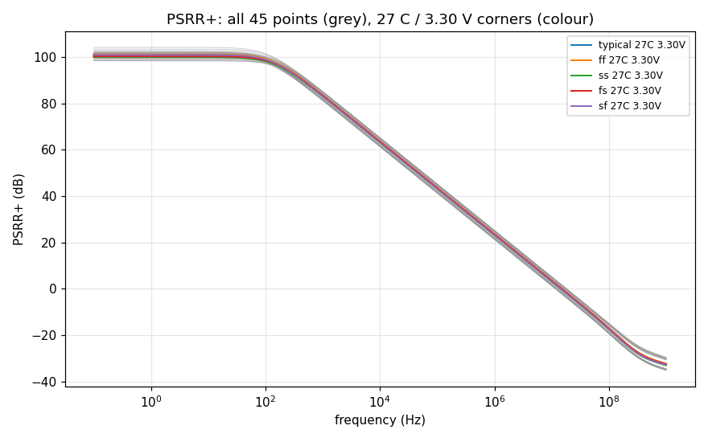
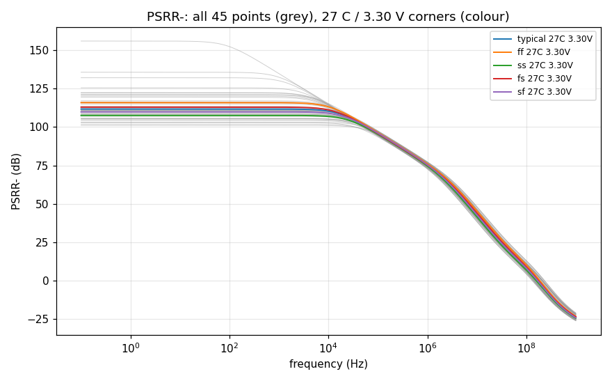
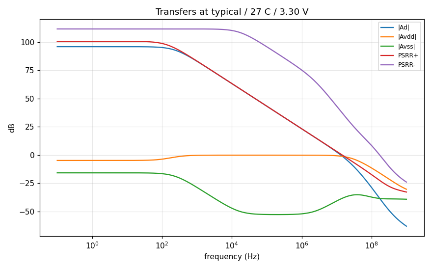

# PSRR record `20261009-105929-30ec86d`

- **Date**: 2026-10-09 10:59 UTC; commit `30ec86d`; issue #39
- **DUT**: `design/netlist/opamp_two_stage.spice` (sha256 of the wrapper-normalised include `81fbd914f8254a49`), unchanged; snapshot `netlist-snapshots/20261009-105929-30ec86d.spice`
- **PDK revision**: gf180mcuD, open_pdks `c6d73a35f524070e85faff4a6a9eef49553ebc2b` (harness `find_pdk`, via volare-default); the local single units are pinned to it (`models.pdk_root`).
  - klt's `provenance.pdk` and `environment.models_lib_sha256` in the grid reports are resolved on the SUBMITTING CLIENT (open_pdks f6eeac7dad085ffcc829ccfd721f7b4ce39edcf7 (search root: ~/.ciel)), not on the fleet runner, which uses its own install and (klt 0.5.0) does not report its revision. The fleet library is tied to the pinned revision indirectly: the local pinned units reproduce the grid's nominal point, and the grid's open-loop response reproduces the committed gain-bench record (see Cross-checks).
- **Tools**: ngspice local `ngspice-46 : Circuit level simulation program`, klt `klt 0.7.0+g5c94de0ebbfe`, numpy `1.26.4`
- **Execution**: three `klt sim` corner requests (one per excitation), 45 points each:
  - `dm`: backend `aws-batch-fleet`, job `klt-sim-3929d8beedc5`, Spot m7i.4xlarge, state `done`, runner klt `0.5.0` vs client `0.7.0+g5c94de0ebbfe` (compatibility `mismatch`); engine `ngspice 46`; wall 114 s
  - `vdd`: backend `aws-batch-fleet`, job `klt-sim-65c93433b051`, Spot c7i.8xlarge, state `done`, runner klt `0.5.0` vs client `0.7.0+g5c94de0ebbfe` (compatibility `mismatch`); engine `ngspice 46`; wall 84 s
  - `vss`: backend `aws-batch-fleet`, job `klt-sim-0e2c841f34b9`, Spot c7i.8xlarge, state `done`, runner klt `0.5.0` vs client `0.7.0+g5c94de0ebbfe` (compatibility `mismatch`); engine `ngspice 46`; wall 84 s
  - Local single units (studies/controls below) run with an empty `HOME` so no user `~/.spiceinit` applies (the fleet grid runs without one; DR-0004).
- **Corner matrix**: process typical, ff, ss, fs, sf; T -40 C, 27 C, 125 C; VDD 2.97 V, 3.30 V, 3.63 V (DC input common mode = VDD/2); ibias = 10 uA (ideal); CL = 2 pF. Every MOS corner uses `res_typical` + `mimcap_typical` (RZ/CC passive spread is NOT swept).

## Claim

**Measured, no pass or fail verdict: the row's bound is not ratified** (DR-3 residual (e4)). `spec/target-spec.md` and the decision records are untouched; a proposed bound citing this record is a separate decision-record issue for a human to ratify.

**Definitions and references.** Input-referred PSRR+/- = 20 log10 |Ad / Asupply|, Asupply = vout / v(rail) with one rail driven (1 V AC) at a time, the other rail and both inputs AC-quiet. Inputs (`Vcm`, the servo), the load CL and `Vdd` are referenced to simulator ground; for PSRR- the DUT's `vss` port is a driven node (`Vss vss 0 dc 0 ac 1`), so only the DUT's ground rail moves. The output supply feedthrough -20 log10 |Asupply| is a different quantity and is reported separately below. The ideal 10 uA bias source has zero small-signal current: **bias-generator supply rejection is excluded** (an on-chip reference would add its own). Matched devices: the figures are systematic, not mismatch-limited.

## PSRR+ worst case over the 45 points

| PSRR+ figure | worst (lowest) value (dB) | worst-case corner (process / T / VDD) | best (dB) | points without the figure |
|---|---|---|---|---|
| DC plateau (0.1-1 Hz) | **98.45** | fs / -40 C / 2.97 V | 104.22 | 0 |
| 1 kHz | **81.24** | ss / 125 C / 2.97 V | 85.22 | 0 |
| 10 kHz | **61.31** | ss / 125 C / 2.97 V | 65.28 | 0 |
| 100 kHz | **41.31** | ss / 125 C / 2.97 V | 45.28 | 0 |
| 1 MHz | **21.31** | ss / 125 C / 2.97 V | 25.28 | 0 |
| at f_u (differential unity gain) | **0.86** | sf / -40 C / 2.97 V | 1.00 | 0 |

- Plateau verified at 45/45 points; lower bounds (numerical floor): 0/45.
- Avdd keeps one sign (plateau phase ~0 deg) at all 45 points; no PSRR+ value exceeds the grid median (100.7 dB) by more than 20 dB.
- Output supply feedthrough -20 log10 |Avdd| at the plateau (NOT PSRR): 2.45 dB (fs / -40 C / 2.97 V) .. 7.04 dB (sf / -40 C / 3.63 V).

## PSRR- worst case over the 45 points

| PSRR- figure | worst (lowest) value (dB) | worst-case corner (process / T / VDD) | best (dB) | points without the figure |
|---|---|---|---|---|
| DC plateau (0.1-1 Hz) | **101.01** | ss / -40 C / 2.97 V | 155.96 | 0 |
| 1 kHz | **101.01** | ss / -40 C / 2.97 V | 134.76 | 0 |
| 10 kHz | **100.89** | ss / -40 C / 2.97 V | 115.24 | 0 |
| 100 kHz | **93.48** | ss / 125 C / 2.97 V | 97.54 | 0 |
| 1 MHz | **72.60** | ss / 125 C / 2.97 V | 77.34 | 0 |
| at f_u (differential unity gain) | **37.14** | ss / -40 C / 2.97 V | 40.50 | 0 |

- Plateau verified at 45/45 points; lower bounds (numerical floor): 0/45.
- **Avss changes sign across the grid**: its plateau phase is ~180 deg at 41 points and ~0 deg at 4 (ff / 125 C / 3.30 V, ff / 125 C / 3.63 V, fs / 125 C / 3.63 V, typical / 125 C / 3.63 V). The systematic Avss passes through zero somewhere in PVT, so near the flip the low-frequency PSRR- is a cancellation.
  - ff / 125 C / 3.30 V: PSRR- 135.7 dB at 0.1 Hz, 24.8 dB above the grid median; |Avss| = 0.00916 V/V, 7.9 decades above the numerical floor (numerically resolved).
  - fs / 125 C / 3.30 V: PSRR- 132.1 dB at 0.1 Hz, 21.2 dB above the grid median; |Avss| = 0.0139 V/V, 8.1 decades above the numerical floor (numerically resolved).
  - typical / 125 C / 3.63 V: PSRR- 156.0 dB at 0.1 Hz, 45.1 dB above the grid median; |Avss| = 0.000945 V/V, 6.9 decades above the numerical floor (numerically resolved).
- Such values are numerically real for the matched schematic but are NOT design margin: a mismatch-sized perturbation of the cancelling terms removes them. Use the worst-case figure.
- Output supply feedthrough -20 log10 |Avss| at the plateau (NOT PSRR): 5.19 dB (ss / -40 C / 2.97 V) .. 60.49 dB (typical / 125 C / 3.63 V).

- f_u over the grid: 10.418 .. 16.528 MHz; Ad plateau 93.79 .. 97.41 dB.

## Method

- `.ac dec 20 0.1 1e+09` (201 points) per point and excitation (`dm`, `vdd`, `vss`), the CMRR bench's DC servo (unity-buffer DC point, open loop at every swept frequency, vout unloaded).
- Ad = v(vout) / (v(vinp) - v(vinn)) of the `dm` run (actual phasors); Asupply = v(vout) / v(rail) of the supply run (actual rail phasor).
- **DC** = mean PSRR over 0.1-1 Hz, valid only if the PSRR and |Asupply| are flat there to 0.1 dB (else reported unavailable). Spot values and the value at f_u: linear interpolation in (log10 f, dB); f_u = first descending 0 dB crossing of |Ad| (the gain driver's extraction).
- **Numerical floor**: |Asupply| below 10 x the demonstrated superposition residual (= 1.1e-10 V/V) is clamped and the figure reported as a lower bound (`>=`).
- **Blocking validation**: 45/45 points per excitation, identical frequency axes, finite data; `dm`: vd = 1 V, vc = 0, rails quiet (all to 1e-06 V); supply runs: driven rail = 1 V, other rail quiet (to 1e-06 V), both inputs quiet to 1e-09 V and the input-leak term |Ad vd| below 1e-06 of the output; operating point; Ad vs the gain bench; local vs grid; studies/controls.

## Excitation and cross-checks

- Max excitation error 1.18e-13 V; max input phasor in the supply runs 1.2e-18 V; max input-leak fraction 1.18e-13.
- **Ad vs the gain bench** (`sim/gain-gbw-pm/corners/20261009-055759-2524b3e`), all 45 points, 0.1 Hz to f_u: max deviation 3.64e-03 dB (tolerance 0.05 dB). The gain bench drives vinp alone, so its response is Ad + Acm/2; below f_u the Acm/2 term is negligible (the CMRR record compares the exact Ad + Acm/2 over the whole sweep).
- **Local nominal unit vs the grid's nominal point**: PSRR+/- differ by at most 0.0000 dB (tolerance 0.05 dB).

## Operating point (every point, every excitation)

The analysis line prints the DC operating point of the same deck after the `.ac` sweep (`op` + `print`, retained in each point's log). Blocking: the operating point is returned, |vout - VCM| <= 100 mV (no saturated or differently biased DUT), and every excitation of a point sits at the same DC vout to 1 uV. Recorded: each DUT MOSFET's saturation margin |Vds| - |Vdsat|.

- max |vout - VCM| over the grid: 0.035 mV; max DC vout disagreement between excitations: 0.0000 uV.
- smallest device saturation margin: 220 mV at ss / -40 C / 2.97 V.
- points with a device below saturation: 0/45

## PSRR+ at all 45 points (dB, input-referred)

| point | PSRR+ DC | 1 kHz | 10 kHz | 100 kHz | 1 MHz | at f_u | f_u (MHz) | note |
|---|---|---|---|---|---|---|---|---|
| typical / -40 C / 2.97 V | 99.28 | 84.68 | 64.84 | 44.84 | 24.84 | 0.92 | 15.679 |  |
| typical / 27 C / 2.97 V | 99.34 | 83.22 | 63.33 | 43.33 | 23.33 | 0.93 | 13.164 |  |
| typical / 125 C / 2.97 V | 100.28 | 81.62 | 61.68 | 41.68 | 21.68 | 0.94 | 10.877 |  |
| typical / -40 C / 3.30 V | 100.95 | 84.78 | 64.89 | 44.89 | 24.89 | 0.92 | 15.768 |  |
| typical / 27 C / 3.30 V | 100.74 | 83.29 | 63.37 | 43.37 | 23.37 | 0.93 | 13.220 |  |
| typical / 125 C / 3.30 V | 101.17 | 81.66 | 61.71 | 41.71 | 21.71 | 0.94 | 10.911 |  |
| typical / -40 C / 3.63 V | 102.88 | 84.86 | 64.93 | 44.93 | 24.93 | 0.92 | 15.849 |  |
| typical / 27 C / 3.63 V | 102.05 | 83.34 | 63.40 | 43.40 | 23.40 | 0.93 | 13.271 |  |
| typical / 125 C / 3.63 V | 101.53 | 81.69 | 61.73 | 41.73 | 21.73 | 0.94 | 10.942 |  |
| ff / -40 C / 2.97 V | 99.94 | 85.05 | 65.19 | 45.19 | 25.19 | 0.91 | 16.360 |  |
| ff / 27 C / 2.97 V | 99.92 | 83.58 | 63.69 | 43.69 | 23.69 | 0.91 | 13.735 |  |
| ff / 125 C / 2.97 V | 100.66 | 81.99 | 62.04 | 42.04 | 22.04 | 0.93 | 11.350 |  |
| ff / -40 C / 3.30 V | 101.55 | 85.14 | 65.24 | 45.24 | 25.24 | 0.91 | 16.447 |  |
| ff / 27 C / 3.30 V | 101.22 | 83.65 | 63.72 | 43.72 | 23.72 | 0.91 | 13.791 |  |
| ff / 125 C / 3.30 V | 101.38 | 82.02 | 62.07 | 42.07 | 22.07 | 0.93 | 11.383 |  |
| ff / -40 C / 3.63 V | 103.48 | 85.22 | 65.28 | 45.28 | 25.28 | 0.91 | 16.528 |  |
| ff / 27 C / 3.63 V | 102.40 | 83.70 | 63.75 | 43.75 | 23.75 | 0.92 | 13.842 |  |
| ff / 125 C / 3.63 V | 101.48 | 82.04 | 62.09 | 42.09 | 22.09 | 0.93 | 11.413 |  |
| ss / -40 C / 2.97 V | 98.45 | 84.30 | 64.47 | 44.47 | 24.47 | 0.94 | 15.004 |  |
| ss / 27 C / 2.97 V | 98.49 | 82.85 | 62.96 | 42.97 | 22.97 | 0.93 | 12.615 |  |
| ss / 125 C / 2.97 V | 99.41 | 81.24 | 61.31 | 41.31 | 21.31 | 0.94 | 10.418 |  |
| ss / -40 C / 3.30 V | 100.20 | 84.41 | 64.53 | 44.53 | 24.53 | 0.94 | 15.097 |  |
| ss / 27 C / 3.30 V | 100.02 | 82.92 | 63.01 | 43.01 | 23.01 | 0.93 | 12.673 |  |
| ss / 125 C / 3.30 V | 100.52 | 81.29 | 61.34 | 41.34 | 21.34 | 0.94 | 10.455 |  |
| ss / -40 C / 3.63 V | 102.12 | 84.50 | 64.58 | 44.58 | 24.58 | 0.94 | 15.178 |  |
| ss / 27 C / 3.63 V | 101.43 | 82.98 | 63.04 | 43.04 | 23.04 | 0.94 | 12.724 |  |
| ss / 125 C / 3.63 V | 101.15 | 81.32 | 61.37 | 41.37 | 21.37 | 0.94 | 10.486 |  |
| fs / -40 C / 2.97 V | 98.45 | 84.83 | 65.03 | 45.03 | 25.03 | 0.98 | 15.908 |  |
| fs / 27 C / 2.97 V | 98.80 | 83.39 | 63.52 | 43.52 | 23.52 | 0.99 | 13.355 |  |
| fs / 125 C / 2.97 V | 100.51 | 81.81 | 61.87 | 41.87 | 21.87 | 1.00 | 11.038 |  |
| fs / -40 C / 3.30 V | 100.18 | 84.95 | 65.08 | 45.08 | 25.08 | 0.99 | 15.998 |  |
| fs / 27 C / 3.30 V | 100.33 | 83.47 | 63.56 | 43.56 | 23.56 | 0.99 | 13.413 |  |
| fs / 125 C / 3.30 V | 101.53 | 81.85 | 61.90 | 41.90 | 21.90 | 1.00 | 11.075 |  |
| fs / -40 C / 3.63 V | 101.85 | 85.03 | 65.12 | 45.13 | 25.13 | 0.99 | 16.078 |  |
| fs / 27 C / 3.63 V | 101.67 | 83.52 | 63.59 | 43.59 | 23.59 | 0.99 | 13.465 |  |
| fs / 125 C / 3.63 V | 102.23 | 81.88 | 61.92 | 41.92 | 21.92 | 1.00 | 11.107 |  |
| sf / -40 C / 2.97 V | 99.92 | 84.51 | 64.64 | 44.64 | 24.64 | 0.86 | 15.433 |  |
| sf / 27 C / 2.97 V | 99.63 | 83.04 | 63.14 | 43.14 | 23.14 | 0.87 | 12.964 |  |
| sf / 125 C / 2.97 V | 99.84 | 81.42 | 61.49 | 41.49 | 21.49 | 0.88 | 10.708 |  |
| sf / -40 C / 3.30 V | 101.74 | 84.60 | 64.69 | 44.69 | 24.69 | 0.86 | 15.523 |  |
| sf / 27 C / 3.30 V | 100.99 | 83.10 | 63.17 | 43.17 | 23.17 | 0.87 | 13.019 |  |
| sf / 125 C / 3.30 V | 100.49 | 81.46 | 61.51 | 41.51 | 21.51 | 0.88 | 10.742 |  |
| sf / -40 C / 3.63 V | 104.22 | 84.69 | 64.74 | 44.74 | 24.74 | 0.86 | 15.602 |  |
| sf / 27 C / 3.63 V | 102.25 | 83.15 | 63.21 | 43.21 | 23.21 | 0.87 | 13.069 |  |
| sf / 125 C / 3.63 V | 100.26 | 81.48 | 61.54 | 41.54 | 21.54 | 0.88 | 10.771 |  |

## PSRR- at all 45 points (dB, input-referred)

| point | PSRR- DC | 1 kHz | 10 kHz | 100 kHz | 1 MHz | at f_u | f_u (MHz) | note |
|---|---|---|---|---|---|---|---|---|
| typical / -40 C / 2.97 V | 104.83 | 104.83 | 104.58 | 96.36 | 76.51 | 38.34 | 15.679 |  |
| typical / 27 C / 2.97 V | 107.01 | 107.00 | 106.48 | 95.54 | 75.13 | 38.57 | 13.164 |  |
| typical / 125 C / 2.97 V | 110.64 | 110.62 | 109.14 | 94.36 | 73.41 | 38.75 | 10.877 |  |
| typical / -40 C / 3.30 V | 108.04 | 108.04 | 107.54 | 96.83 | 76.68 | 38.56 | 15.768 |  |
| typical / 27 C / 3.30 V | 111.69 | 111.67 | 110.33 | 95.92 | 75.32 | 38.79 | 13.220 |  |
| typical / 125 C / 3.30 V | 120.13 | 119.98 | 113.60 | 94.67 | 73.64 | 38.97 | 10.911 |  |
| typical / -40 C / 3.63 V | 110.89 | 110.88 | 109.98 | 97.02 | 76.73 | 38.72 | 15.849 |  |
| typical / 27 C / 3.63 V | 116.30 | 116.25 | 113.18 | 96.04 | 75.40 | 38.97 | 13.271 |  |
| typical / 125 C / 3.63 V | 155.96 | 134.76 | 114.80 | 94.79 | 73.78 | 39.17 | 10.942 |  |
| ff / -40 C / 2.97 V | 107.68 | 107.68 | 107.25 | 97.09 | 77.13 | 39.69 | 16.360 |  |
| ff / 27 C / 2.97 V | 111.46 | 111.45 | 110.24 | 96.20 | 75.82 | 39.90 | 13.735 |  |
| ff / 125 C / 2.97 V | 121.05 | 120.88 | 114.00 | 94.93 | 74.19 | 40.05 | 11.350 |  |
| ff / -40 C / 3.30 V | 110.25 | 110.24 | 109.52 | 97.41 | 77.29 | 39.90 | 16.447 |  |
| ff / 27 C / 3.30 V | 115.87 | 115.83 | 113.17 | 96.46 | 76.01 | 40.12 | 13.791 |  |
| ff / 125 C / 3.30 V | 135.66 | 132.40 | 115.14 | 95.17 | 74.43 | 40.29 | 11.383 |  |
| ff / -40 C / 3.63 V | 112.87 | 112.85 | 111.63 | 97.54 | 77.34 | 40.08 | 16.528 |  |
| ff / 27 C / 3.63 V | 121.07 | 120.95 | 115.24 | 96.54 | 76.08 | 40.32 | 13.842 |  |
| ff / 125 C / 3.63 V | 122.36 | 122.14 | 114.50 | 95.26 | 74.55 | 40.50 | 11.413 |  |
| ss / -40 C / 2.97 V | 101.01 | 101.01 | 100.89 | 95.27 | 75.88 | 37.14 | 15.004 |  |
| ss / 27 C / 2.97 V | 101.84 | 101.84 | 101.66 | 94.54 | 74.42 | 37.38 | 12.615 |  |
| ss / 125 C / 2.97 V | 102.84 | 102.84 | 102.52 | 93.48 | 72.60 | 37.60 | 10.418 |  |
| ss / -40 C / 3.30 V | 105.43 | 105.42 | 105.12 | 96.17 | 76.04 | 37.40 | 15.097 |  |
| ss / 27 C / 3.30 V | 107.53 | 107.52 | 106.90 | 95.30 | 74.61 | 37.64 | 12.673 |  |
| ss / 125 C / 3.30 V | 110.78 | 110.76 | 109.16 | 94.11 | 72.82 | 37.84 | 10.455 |  |
| ss / -40 C / 3.63 V | 108.72 | 108.71 | 108.08 | 96.48 | 76.10 | 37.57 | 15.178 |  |
| ss / 27 C / 3.63 V | 112.20 | 112.18 | 110.58 | 95.53 | 74.70 | 37.82 | 12.724 |  |
| ss / 125 C / 3.63 V | 119.37 | 119.24 | 113.14 | 94.30 | 72.96 | 38.03 | 10.486 |  |
| fs / -40 C / 2.97 V | 105.71 | 105.71 | 105.39 | 96.30 | 76.40 | 38.73 | 15.908 |  |
| fs / 27 C / 2.97 V | 108.86 | 108.85 | 108.04 | 95.47 | 75.06 | 38.96 | 13.355 |  |
| fs / 125 C / 2.97 V | 116.15 | 116.08 | 112.12 | 94.26 | 73.41 | 39.13 | 11.038 |  |
| fs / -40 C / 3.30 V | 108.29 | 108.29 | 107.74 | 96.68 | 76.57 | 38.93 | 15.998 |  |
| fs / 27 C / 3.30 V | 112.94 | 112.92 | 111.15 | 95.77 | 75.26 | 39.17 | 13.413 |  |
| fs / 125 C / 3.30 V | 132.08 | 130.12 | 114.45 | 94.52 | 73.64 | 39.36 | 11.075 |  |
| fs / -40 C / 3.63 V | 110.57 | 110.56 | 109.68 | 96.82 | 76.62 | 39.10 | 16.078 |  |
| fs / 27 C / 3.63 V | 117.09 | 117.03 | 113.45 | 95.87 | 75.34 | 39.36 | 13.465 |  |
| fs / 125 C / 3.63 V | 125.53 | 125.03 | 114.29 | 94.62 | 73.78 | 39.56 | 11.107 |  |
| sf / -40 C / 2.97 V | 103.14 | 103.14 | 102.97 | 96.26 | 76.63 | 37.99 | 15.433 |  |
| sf / 27 C / 2.97 V | 104.25 | 104.24 | 103.97 | 95.46 | 75.20 | 38.22 | 12.964 |  |
| sf / 125 C / 2.97 V | 105.52 | 105.51 | 105.02 | 94.31 | 73.41 | 38.41 | 10.708 |  |
| sf / -40 C / 3.30 V | 107.39 | 107.38 | 106.97 | 96.96 | 76.78 | 38.23 | 15.523 |  |
| sf / 27 C / 3.30 V | 109.83 | 109.82 | 108.94 | 96.04 | 75.38 | 38.47 | 13.019 |  |
| sf / 125 C / 3.30 V | 113.51 | 113.48 | 111.12 | 94.79 | 73.63 | 38.65 | 10.742 |  |
| sf / -40 C / 3.63 V | 111.10 | 111.09 | 110.19 | 97.22 | 76.84 | 38.40 | 15.602 |  |
| sf / 27 C / 3.63 V | 114.95 | 114.92 | 112.55 | 96.21 | 75.46 | 38.65 | 13.069 |  |
| sf / 125 C / 3.63 V | 122.26 | 122.03 | 114.22 | 94.95 | 73.77 | 38.84 | 10.771 |  |

## Ad, Avdd, Avss at the plateau (dB)

| point | Ad | Avdd | Avss | PSRR+ DC | PSRR- DC |
|---|---|---|---|---|---|
| typical / -40 C / 2.97 V | 96.12 | -3.16 | -8.71 | 99.28 | 104.83 |
| typical / 27 C / 2.97 V | 95.28 | -4.06 | -11.73 | 99.34 | 107.01 |
| typical / 125 C / 2.97 V | 94.14 | -6.14 | -16.50 | 100.28 | 110.64 |
| typical / -40 C / 3.30 V | 96.79 | -4.15 | -11.25 | 100.95 | 108.04 |
| typical / 27 C / 3.30 V | 95.99 | -4.75 | -15.70 | 100.74 | 111.69 |
| typical / 125 C / 3.30 V | 94.89 | -6.28 | -25.23 | 101.17 | 120.13 |
| typical / -40 C / 3.63 V | 97.29 | -5.59 | -13.60 | 102.88 | 110.89 |
| typical / 27 C / 3.63 V | 96.52 | -5.52 | -19.77 | 102.05 | 116.30 |
| typical / 125 C / 3.63 V | 95.47 | -6.06 | -60.49 | 101.53 | 155.96 |
| ff / -40 C / 2.97 V | 96.29 | -3.65 | -11.39 | 99.94 | 107.68 |
| ff / 27 C / 2.97 V | 95.42 | -4.51 | -16.04 | 99.92 | 111.46 |
| ff / 125 C / 2.97 V | 94.19 | -6.48 | -26.86 | 100.66 | 121.05 |
| ff / -40 C / 3.30 V | 96.94 | -4.61 | -13.31 | 101.55 | 110.25 |
| ff / 27 C / 3.30 V | 96.10 | -5.12 | -19.77 | 101.22 | 115.87 |
| ff / 125 C / 3.30 V | 94.90 | -6.48 | -40.76 | 101.38 | 135.66 |
| ff / -40 C / 3.63 V | 97.41 | -6.07 | -15.46 | 103.48 | 112.87 |
| ff / 27 C / 3.63 V | 96.60 | -5.80 | -24.47 | 102.40 | 121.07 |
| ff / 125 C / 3.63 V | 95.44 | -6.03 | -26.91 | 101.48 | 122.36 |
| ss / -40 C / 2.97 V | 95.81 | -2.64 | -5.19 | 98.45 | 101.01 |
| ss / 27 C / 2.97 V | 94.95 | -3.53 | -6.89 | 98.49 | 101.84 |
| ss / 125 C / 2.97 V | 93.79 | -5.62 | -9.05 | 99.41 | 102.84 |
| ss / -40 C / 3.30 V | 96.52 | -3.68 | -8.91 | 100.20 | 105.43 |
| ss / 27 C / 3.30 V | 95.70 | -4.32 | -11.83 | 100.02 | 107.53 |
| ss / 125 C / 3.30 V | 94.59 | -5.94 | -16.20 | 100.52 | 110.78 |
| ss / -40 C / 3.63 V | 97.05 | -5.07 | -11.67 | 102.12 | 108.72 |
| ss / 27 C / 3.63 V | 96.27 | -5.16 | -15.94 | 101.43 | 112.20 |
| ss / 125 C / 3.63 V | 95.21 | -5.94 | -24.17 | 101.15 | 119.37 |
| fs / -40 C / 2.97 V | 96.00 | -2.45 | -9.70 | 98.45 | 105.71 |
| fs / 27 C / 2.97 V | 95.20 | -3.60 | -13.67 | 98.80 | 108.86 |
| fs / 125 C / 2.97 V | 94.10 | -6.41 | -22.05 | 100.51 | 116.15 |
| fs / -40 C / 3.30 V | 96.73 | -3.45 | -11.56 | 100.18 | 108.29 |
| fs / 27 C / 3.30 V | 95.96 | -4.37 | -16.98 | 100.33 | 112.94 |
| fs / 125 C / 3.30 V | 94.91 | -6.62 | -37.17 | 101.53 | 132.08 |
| fs / -40 C / 3.63 V | 97.28 | -4.57 | -13.29 | 101.85 | 110.57 |
| fs / 27 C / 3.63 V | 96.55 | -5.11 | -20.53 | 101.67 | 117.09 |
| fs / 125 C / 3.63 V | 95.56 | -6.67 | -29.97 | 102.23 | 125.53 |
| sf / -40 C / 2.97 V | 96.13 | -3.79 | -7.01 | 99.92 | 103.14 |
| sf / 27 C / 2.97 V | 95.23 | -4.40 | -9.01 | 99.63 | 104.25 |
| sf / 125 C / 2.97 V | 93.99 | -5.85 | -11.53 | 99.84 | 105.52 |
| sf / -40 C / 3.30 V | 96.75 | -4.99 | -10.63 | 101.74 | 107.39 |
| sf / 27 C / 3.30 V | 95.88 | -5.11 | -13.95 | 100.99 | 109.83 |
| sf / 125 C / 3.30 V | 94.68 | -5.80 | -18.83 | 100.49 | 113.51 |
| sf / -40 C / 3.63 V | 97.18 | -7.04 | -13.93 | 104.22 | 111.10 |
| sf / 27 C / 3.63 V | 96.34 | -5.91 | -18.61 | 102.25 | 114.95 |
| sf / 125 C / 3.63 V | 95.19 | -5.08 | -27.07 | 100.26 | 122.26 |

## Studies and negative controls (local single units, typical / 27 C / 3.30 V)

- **Numerical floor (superposition)**: |vout(both rails) - vout(vdd only) - vout(vss only)| max 1.1e-11 V; floor = max(10 x that, 1e-15) = 1.1e-10 V/V. Grid |Asupply| minimum: 0.000945 V/V.

| study / control | condition | outcome | PSRR+ 0.1 Hz | PSRR+ at f_u | PSRR- 0.1 Hz | PSRR- at f_u | criterion |
|---|---|---|---|---|---|---|---|
| isolation (nominal) | tau = 1e18 s | valid | 100.739 | 0.928 | 111.687 | 38.793 | reference |
| isolation | tau = 1e+16 s | valid | 100.739 | 0.928 | 111.687 | 38.793 | moves <= 0.01 dB |
| isolation | tau = 1e+20 s | valid | 100.739 | 0.928 | 111.687 | 38.793 | moves <= 0.01 dB |
| inadequate isolation | tau = 1e-3 s | **rejected**: differential excitation off by 13.2 V (> 1e-06): servo isolation or wiring; [vdd] inputs not AC-quiet (0.045 V > 1e-09): servo isolation or reference; [vss] inp | | | | | must be rejected |
| **negative control**: vdd feedthrough | fixture `Rft vdd vout 100000` | valid | 79.997 | 1.086 | 97.734 | 38.058 | PSRR+ drops >= 6 dB |
| **negative control**: vss feedthrough | fixture `Rft vss vout 100000` | valid | 93.654 | 0.919 | 84.421 | 31.324 | PSRR- drops >= 6 dB |

- vdd feedthrough fixture: PSRR+ at 0.1 Hz 80.00 dB vs 100.74 dB (drop 20.74 dB). The fixture is a resistor appended to the bench for the control only (all three excitations of the control carry it); the production DUT and the baseline bench are unchanged. Diagnostic only.
- vss feedthrough fixture: PSRR- at 0.1 Hz 84.42 dB vs 111.69 dB (drop 27.27 dB). The fixture is a resistor appended to the bench for the control only (all three excitations of the control carry it); the production DUT and the baseline bench are unchanged. Diagnostic only.

## Plots





## Reproduce / evidence

```
python3 sim/psrr/run_psrr.py            # full grid + a new record
python3 sim/psrr/run_psrr.py --smoke    # nominal point, local, no record
```

- Per point and excitation: `corners/20261009-105929-30ec86d/<point>.<dm|vdd|vss>.{dat,log,cir}` (actual vout, vinp, vinn, vdd, vss phasors; log with the printed operating point; klt deck); derived curves `<point>.psrr.dat` (freq, |Ad|, |Avdd|, |Avss|, PSRR+, PSRR- in dB); sanitised klt reports; studies/controls under `controls/`.
- Testbench `sim/psrr/testbench/tb_psrr.spice`; driver `sim/psrr/run_psrr.py`; tests `sim/psrr/test_psrr.py`.
- Timestamp / author: 2026-10-09T10:59:29Z, agent-builder (issue #39)
